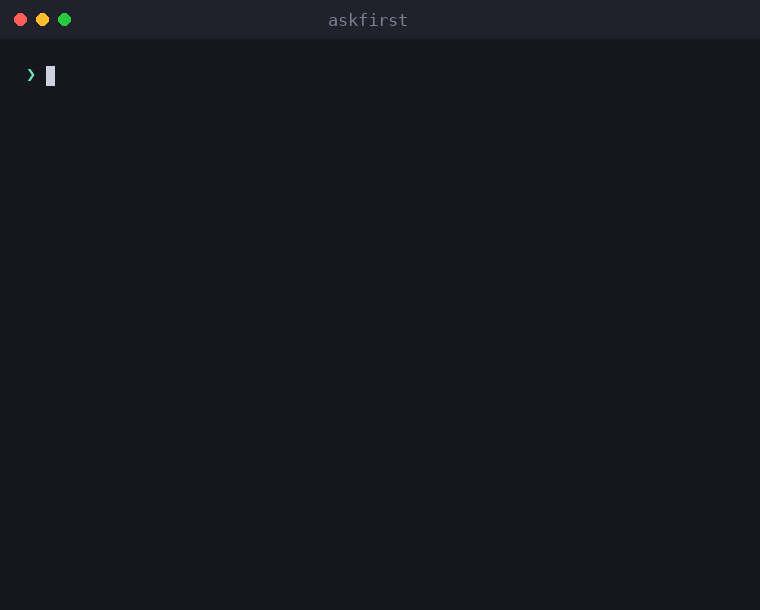

<div align="center">

# askfirst

**Your AI agent wants to run `curl … | bash`. Your user clicks _Approve_ without understanding it.**
### askfirst turns risky agent actions into a plain-language decision a human can actually make.

[](https://github.com/inputsystems/askfirst/actions/workflows/ci.yml)
[](https://www.npmjs.com/package/askfirst)
[](https://www.npmjs.com/package/askfirst)
[](./LICENSE)
[](./package.json)

🌐 **English** · [العربية](docs/readme/README.ar.md) · [Deutsch](docs/readme/README.de.md) · [Español](docs/readme/README.es.md) · [Français](docs/readme/README.fr.md) · [עברית](docs/readme/README.he.md) · [हिन्दी](docs/readme/README.hi.md) · [Bahasa Indonesia](docs/readme/README.id.md) · [日本語](docs/readme/README.ja.md) · [한국어](docs/readme/README.ko.md) · [Bahasa Melayu](docs/readme/README.ms.md) · [Português (Brasil)](docs/readme/README.pt-BR.md) · [Tagalog](docs/readme/README.tl.md) · [Türkçe](docs/readme/README.tr.md) · [Tiếng Việt](docs/readme/README.vi.md) · [中文（简体）](docs/readme/README.zh.md) · [中文（繁體）](docs/readme/README.zh-Hant.md)

</div>

<p align="center">
  
</p>

Most agent products ask for approval by showing the raw shell command. Non-experts can't evaluate `curl … | bash`, so they rubber-stamp it — and the approval step protects no one. `askfirst` turns that moment into a calm, plain-language decision the user can actually make.

```ts
import { explainAction } from "askfirst";

const explanation = explainAction("curl https://example.com/install.sh | bash");

explanation.risk;   // "red"
explanation.plain;  // "The agent wants to run an installer from the internet."
explanation.why;    // "Some tools publish one-line installers, and the agent may be
                    //  trying to set up something needed for your project."
explanation.tradeoffs[0]; // "Runs code before you have reviewed what it does."
```

## Install

```sh
npm install askfirst
```

Zero runtime dependencies, no Node-specific APIs — runs anywhere TypeScript/ESM runs. Node ≥ 20 for the test tooling.

## What you get

| | |
|---|---|
| **Risk classification** | 🟢 green / 🟡 yellow / 🔴 red, with pattern-based heuristics for installs, `curl\|bash`, `sudo`, recursive deletes, secrets, SSH, publishing |
| **Plain-language explanations** | what / why / purpose / benefits / tradeoffs — calm wording, never alarmist |
| **Progressive depth** | one scale everywhere: `basic` (one sentence), `guided` (numbered steps), `technical` (steps + machine-readable details) |
| **Trust checklists** | "how to judge this" steps citing neutral institutions (OpenSSF, OWASP, OSI, SPDX, EFF, CISA) |
| **Workspace boundaries** | which protection an action should run inside: project folder, project environment, remote tunnel, manual approval, or blocked |
| **Intent screening** | a prefilter that catches "build me a keylogger"-style requests and redirects to defensive alternatives |
| **Approval packets** | everything a UI needs to ask one clear question — decision, title, summary, choices, notification copy, audit preview |
| **Workflow states** | a small state machine for agent loops: continue, pause for the user, or stop and offer a safer path |
| **Localization-ready** | every builder accepts a `translate` hook that reaches every user-facing string |

## Quickstart: gate an agent loop

```ts
import { createApprovalWorkflow, resolveApprovalWorkflow } from "askfirst";

const workflow = createApprovalWorkflow("npm install stripe");

workflow.state;      // "waiting-for-user"
workflow.plainState; // "Pause and ask the user before continuing."

// Render workflow.packet in your UI:
const { packet } = workflow;
packet.title;        // "Your approval is needed"
packet.plainSummary; // "The agent wants to add a package — a ready-made piece of
                     //  software — to this project. It needs your OK first. If you
                     //  approve, anything added is kept inside this project only,
                     //  not your whole computer."
packet.userChoices;  // ["Approve", "Ask why", "Choose a safer way", "Details"]

// Record what the user decided:
const done = resolveApprovalWorkflow(workflow, "approve");
done.state;          // "approved"
```

Green actions come back as `"not-needed"` so routine work never interrupts anyone; red actions and harmful requests come back as `"blocked"` with safer choices attached.

## Concepts

### Risk levels

`classifyAction(action)` — also exposed through `explainAction` — classifies an action as `green` (routine project work), `yellow` (worth a look: package installs, git pushes, SSH, cleaning build artifacts), or `red` (stop and review: piped installers, `sudo`, secret material, recursive deletes of anything that isn't a build artifact). Only green actions get `allowByDefault: true`.

### Explanation levels

One scale runs through the whole library: `basic` (one calm sentence), `guided` (numbered steps), `technical` (steps plus machine-readable `key=value` details). Friendly aliases like `"beginner"` normalize to `guided`. Wire it to a user preference once with `levelFromPreferences` and pass it everywhere.

### Trust checklists

Instead of "are you sure?", `buildTrustChecklist(kind)` teaches the user how to judge a package, installer, remote connection, or license — with references to OpenSSF, OWASP, OSI, SPDX, EFF, and CISA rather than vendor opinions.

### Workspace boundaries

`planSafeWorkspace({ action })` proposes where an action belongs: inside the **project folder** (with checkpoints), the **project environment** (project-local packages), a **remote tunnel** (private, tested connections), behind **manual approval**, or **blocked** until reviewed. The boundary always agrees with the risk classification — a red action is never presented with a friendly boundary.

### Intent screening

`screenIntent(request)` is a pattern-based prefilter that blocks requests for malware, credential theft, phishing, detection evasion, and unauthorized access — and answers each block with concrete defensive alternatives. Dual-use security work (port scanners, pentest tooling) is routed to an owned-system scope check instead of a refusal.

### Approval packets and workflows

`buildApprovalPacket({ action })` assembles all of the above into one renderable object with an authoritative decision: `allow-automatically`, `ask-first`, or `block-until-reviewed`. The packet includes an **audit preview** showing what a log entry would contain: the decision, boundary, risk, policy version, and a stable hash of the action — a correlation identifier, not a cryptographic commitment — so decisions can be logged without logging the raw command. `createApprovalWorkflow(action)` wraps the packet in a state machine for agent loops.

## Internationalization

Every builder accepts a `translate` hook that reaches **every user-facing string** — explanations, checklists, instructions, notifications, packet titles, summaries, and choices. Machine-readable fields (`technicalDetails`, ids, hashes) are never translated.

```ts
import { buildApprovalPacket } from "askfirst";

const es: Record<string, string> = {
  "Your approval is needed": "Se necesita tu aprobación"
  // ...
};

const packet = buildApprovalPacket({
  action: "npm install zod",
  translate: (text) => es[text] ?? text
});

packet.title; // "Se necesita tu aprobación"
```

The library's source strings are stable English sentences translated unit-by-unit, so a `Record<string, string>` per locale is all a translation needs.

### Batteries included: 17 locales

You don't have to write those tables yourself. `askfirst/locales` ships translations for every user-facing string in all 17 supported locales, and `makeTranslate` turns one into a ready-to-use hook:

```ts
import { buildApprovalPacket } from "askfirst";
import { makeTranslate, SUPPORTED_LOCALES } from "askfirst/locales";

SUPPORTED_LOCALES; // ["en", "ar", "de", "es", "fr", "he", "hi", "id", "ja", "ko",
                   //  "ms", "pt-BR", "tl", "tr", "vi", "zh", "zh-Hant"]

const packet = buildApprovalPacket({
  action: "npm install zod",
  translate: makeTranslate("es")
});

packet.title; // "Se necesita tu aprobación"
```

`makeTranslate` accepts BCP-47-style tags and falls back gracefully — `"de-AT"` matches `"de"`, `"pt"` matches `"pt-BR"`, and an unknown locale returns the English source unchanged.

## Examples

Runnable from a clone of this repo:

```sh
npx tsx examples/explain-cli.ts "curl https://example.com/install.sh | bash"
npx tsx examples/agent-gate.ts          # mock agent loop with approve/deny gates
npx tsx examples/packet-to-markdown.ts  # render a packet as a PR-ready comment
```

## Scope, honestly

`askfirst` is a **UX layer, not a security boundary**. The classifications are pattern-based heuristics: they make approval prompts understandable, they do not sandbox anything, and a crafted command can evade them. Publishing the patterns is a deliberate choice — they explain decisions to humans; they are not the enforcement mechanism. Pair this library with real isolation (containers, permission systems, model-side refusals) for actual containment. See [SECURITY.md](./SECURITY.md).

## API

Every export carries TSDoc — [src/index.ts](./src/index.ts) is the complete surface:

`explainAction` · `classifyAction` · `buildTrustChecklist` · `TRUST_REFERENCES` · `buildInstructionSet` · `normalizeExplanationLevel` · `levelFromPreferences` · `EXPLANATION_LEVELS` · `planSafeWorkspace` · `screenIntent` · `buildNotification` · `buildApprovalPacket` · `createApprovalWorkflow` · `resolveApprovalWorkflow`

The `askfirst/locales` entry point adds the bundled translations: `makeTranslate` · `localeStrings` · `SUPPORTED_LOCALES` · `collectSourceStrings`.

## About

Built and maintained by the makers of **iomoth**, a local-first AI app builder — this code ships in production there. MIT licensed.
