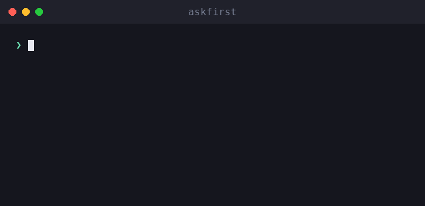

# askfirst

🌐 [English](../../README.md) · **العربية** · [Deutsch](README.de.md) · [Español](README.es.md) · [Français](README.fr.md) · [עברית](README.he.md) · [हिन्दी](README.hi.md) · [Bahasa Indonesia](README.id.md) · [日本語](README.ja.md) · [한국어](README.ko.md) · [Bahasa Melayu](README.ms.md) · [Português (Brasil)](README.pt-BR.md) · [Tagalog](README.tl.md) · [Türkçe](README.tr.md) · [Tiếng Việt](README.vi.md) · [中文（简体）](README.zh.md) · [中文（繁體）](README.zh-Hant.md)

**تجربة مستخدم للموافقة البشرية في وكلاء الذكاء الاصطناعي وواجهات سطر الأوامر.** اشرح الإجراءات الخطرة بلغة بسيطة — ما الإجراء، ولماذا، وفوائده، ومقايضاته، وكيف تقيّمه — *قبل* أن يوافق عليها الإنسان.

[](https://github.com/inputsystems/askfirst/actions/workflows/ci.yml)
[](https://www.npmjs.com/package/askfirst)
[](../../LICENSE)

<p align="center">
  
</p>


وكيلك يريد تشغيل شيء ما. هل يستطيع مستخدمك فهمه؟

```ts
import { explainAction } from "askfirst";

const explanation = explainAction("curl https://example.com/install.sh | bash");

explanation.risk;   // "red"
explanation.plain;  // "The agent wants to run an installer from the internet."
explanation.why;    // "Some tools publish one-line installers, and the agent may be
                    //  trying to set up something needed for your project."
explanation.tradeoffs[0]; // "Runs code before you have reviewed what it does."
```

معظم منتجات الوكلاء تطلب الموافقة بعرض أمر الصدفة الخام. لا يستطيع غير الخبراء تقييم `curl … | bash`، فيوافقون عليه دون تفكير — وتصبح خطوة الموافقة عديمة الفائدة. تحوّل مكتبة `askfirst` تلك اللحظة إلى قرار هادئ بلغة بسيطة يستطيع المستخدم اتخاذه فعلاً.

## التثبيت

```sh
npm install askfirst
```

لا تبعيات وقت تشغيل، ولا واجهات برمجية خاصة بـ Node — تعمل في أي مكان يعمل فيه TypeScript/ESM. يتطلب Node ≥ 20 لأدوات الاختبار.

## ما تحصل عليه

| | |
|---|---|
| **تصنيف المخاطر** | 🟢 أخضر / 🟡 أصفر / 🔴 أحمر، مع قواعد استدلالية مبنية على الأنماط للتثبيتات، و`curl\|bash`، و`sudo`، والحذف التكراري، والأسرار، وSSH، والنشر |
| **شروحات بلغة بسيطة** | ما الإجراء / لماذا / الغرض / الفوائد / المقايضات — بأسلوب هادئ لا ينذر بالخطر |
| **عمق تدريجي** | مقياس واحد في كل مكان: `basic` (جملة واحدة)، `guided` (خطوات مرقّمة)، `technical` (خطوات مع تفاصيل قابلة للقراءة آلياً) |
| **قوائم تحقق الثقة** | خطوات «كيف تقيّم هذا» تستشهد بمؤسسات محايدة (OpenSSF، OWASP، OSI، SPDX، EFF، CISA) |
| **حدود مساحة العمل** | الحماية التي يجب أن يعمل الإجراء ضمنها: مجلد المشروع، بيئة المشروع، النفق البعيد، الموافقة اليدوية، أو محظور |
| **فحص النية** | مرشّح مسبق يرصد طلبات من نوع «ابنِ لي كيلوجر» ويحوّلها إلى بدائل دفاعية |
| **حزم الموافقة** | كل ما تحتاجه واجهة المستخدم لطرح سؤال واضح — القرار، العنوان، الملخص، الخيارات، نص الإشعار، معاينة التدقيق |
| **حالات سير العمل** | آلة حالة صغيرة لحلقات الوكيل: استمر، توقف لانتظار المستخدم، أو أوقف واقترح مساراً أكثر أماناً |
| **جاهز للتوطين** | كل منشئ يقبل خطّاف `translate` يصل إلى كل نص يراه المستخدم |

## البدء السريع: تأمين حلقة وكيل

```ts
import { createApprovalWorkflow, resolveApprovalWorkflow } from "askfirst";

const workflow = createApprovalWorkflow("npm install stripe");

workflow.state;      // "waiting-for-user"
workflow.plainState; // "Pause and ask the user before continuing."

// Render workflow.packet in your UI:
const { packet } = workflow;
packet.title;        // "Your approval is needed"
packet.plainSummary; // "The agent wants to add a package — a ready-made piece of
                     //  software — to this project. It needs your OK first. If you
                     //  approve, anything added is kept inside this project only,
                     //  not your whole computer."
packet.userChoices;  // ["Approve", "Ask why", "Choose a safer way", "Details"]

// Record what the user decided:
const done = resolveApprovalWorkflow(workflow, "approve");
done.state;          // "approved"
```

الإجراءات الخضراء تُرجع `"not-needed"` حتى لا يقاطع العمل الاعتيادي أحداً؛ أما الإجراءات الحمراء والطلبات الضارة فتُرجع `"blocked"` مع خيارات أكثر أماناً مرفقة.

## المفاهيم

### مستويات الخطر

`classifyAction(action)` — المتاح أيضاً عبر `explainAction` — يصنّف الإجراء على أنه `green` (عمل مشروع اعتيادي)، أو `yellow` (يستحق نظرة: تثبيت الحزم، دفع git، SSH، تنظيف مخرجات البناء)، أو `red` (توقف وراجع: مثبّتات مُمرَّرة بالأنابيب، `sudo`، مواد سرية، حذف تكراري لأي شيء ليس أحد مخرجات البناء). الإجراءات الخضراء فقط تحصل على `allowByDefault: true`.

### مستويات الشرح

يسري مقياس واحد في المكتبة بأكملها: `basic` (جملة هادئة واحدة)، `guided` (خطوات مرقّمة)، `technical` (خطوات مع تفاصيل `key=value` قابلة للقراءة آلياً). الأسماء المألوفة مثل `"beginner"` تُعيَّر إلى `guided`. اربطها بتفضيل المستخدم مرة واحدة عبر `levelFromPreferences` ومرّرها في كل مكان.

### قوائم تحقق الثقة

بدلاً من «هل أنت متأكد؟»، تُعلّم `buildTrustChecklist(kind)` المستخدم كيف يقيّم حزمة أو مثبّتاً أو اتصالاً بعيداً أو رخصة — مستشهدةً بـ OpenSSF وOWASP وOSI وSPDX وEFF وCISA بدلاً من آراء المورّد.

### حدود مساحة العمل

`planSafeWorkspace({ action })` تقترح أين ينتمي الإجراء: داخل **مجلد المشروع** (مع نقاط تحقق)، أو **بيئة المشروع** (حزم محلية للمشروع)، أو **نفق بعيد** (اتصالات خاصة ومُختبرة)، أو خلف **موافقة يدوية**، أو **محظور** حتى تتم مراجعته. يتوافق الحد دائماً مع تصنيف الخطر — لا يُعرض الإجراء الأحمر أبداً بحد ودي.

### فحص النية

`screenIntent(request)` مرشّح مسبق مبني على الأنماط يحجب طلبات البرامج الضارة وسرقة بيانات الاعتماد والتصيّد الاحتيالي والتهرب من الكشف والوصول غير المصرح به — ويجيب على كل حجب ببدائل دفاعية ملموسة. عمل الأمان ذو الاستخدام المزدوج (ماسحات المنافذ، أدوات اختبار الاختراق) يُوجَّه إلى فحص نطاق الأنظمة المملوكة بدلاً من الرفض.

### حزم الموافقة وسير العمل

`buildApprovalPacket({ action })` يجمع كل ما سبق في كائن واحد قابل للعرض مع قرار موثوق: `allow-automatically`، أو `ask-first`، أو `block-until-reviewed`. تتضمن الحزمة **معاينة تدقيق** تُظهر ما سيحتويه مدخل السجل: القرار والحد والخطر وإصدار السياسة وتجزئة مستقرة للإجراء — معرّف ارتباط لا التزام تشفيري — حتى يمكن تسجيل القرارات دون تسجيل الأمر الخام. `createApprovalWorkflow(action)` يُغلّف الحزمة في آلة حالة لحلقات الوكيل.

## التدويل

كل منشئ يقبل خطّاف `translate` يصل إلى **كل نص يراه المستخدم** — الشروحات وقوائم التحقق والتعليمات والإشعارات وعناوين الحزم وملخصاتها وخياراتها. الحقول القابلة للقراءة آلياً (`technicalDetails`، المعرّفات، التجزئات) لا تُترجم أبداً.

```ts
import { buildApprovalPacket } from "askfirst";

const es: Record<string, string> = {
  "Your approval is needed": "Se necesita tu aprobación"
  // ...
};

const packet = buildApprovalPacket({
  action: "npm install zod",
  translate: (text) => es[text] ?? text
});

packet.title; // "Se necesita tu aprobación"
```

السلاسل المصدرية في المكتبة جمل إنجليزية مستقرة تُترجم وحدة بوحدة، لذا فإن `Record<string, string>` لكل لغة هو كل ما تحتاجه الترجمة.

## أمثلة

قابلة للتشغيل من نسخة مستنسخة من هذا المستودع:

```sh
npx tsx examples/explain-cli.ts "curl https://example.com/install.sh | bash"
npx tsx examples/agent-gate.ts          # mock agent loop with approve/deny gates
npx tsx examples/packet-to-markdown.ts  # render a packet as a PR-ready comment
```

## النطاق، بصراحة

`askfirst` هي **طبقة تجربة مستخدم، وليست حداً أمنياً**. التصنيفات قواعد استدلالية مبنية على الأنماط: تجعل طلبات الموافقة مفهومة، لكنها لا تعزل أي شيء، ويمكن لأمر مصاغ بعناية التهرب منها. نشر الأنماط خيار متعمد — إنها تشرح القرارات للإنسان؛ وليست آلية التنفيذ. اقرن هذه المكتبة بعزل حقيقي (حاويات، أنظمة أذونات، رفض من جانب النموذج) للاحتواء الفعلي. انظر [SECURITY.md](../../SECURITY.md).

## الواجهة البرمجية

كل تصدير يحمل TSDoc — [src/index.ts](../../src/index.ts) هو السطح الكامل:

`explainAction` · `classifyAction` · `buildTrustChecklist` · `TRUST_REFERENCES` · `buildInstructionSet` · `normalizeExplanationLevel` · `levelFromPreferences` · `EXPLANATION_LEVELS` · `planSafeWorkspace` · `screenIntent` · `buildNotification` · `buildApprovalPacket` · `createApprovalWorkflow` · `resolveApprovalWorkflow`

## حول المكتبة

بناها ويصونها صانعو **iomoth**، أداة بناء تطبيقات ذكاء اصطناعي «محلية أولاً» — يعمل هذا الكود في الإنتاج هناك. مرخّصة برخصة MIT.
