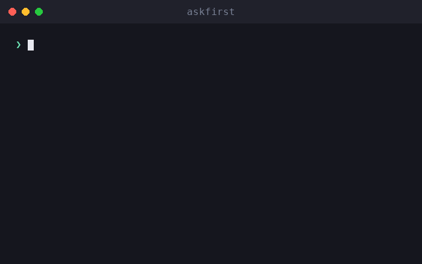

# askfirst

🌐 [English](../../README.md) · [العربية](README.ar.md) · [Deutsch](README.de.md) · **Español** · [Français](README.fr.md) · [עברית](README.he.md) · [हिन्दी](README.hi.md) · [Bahasa Indonesia](README.id.md) · [日本語](README.ja.md) · [한국어](README.ko.md) · [Bahasa Melayu](README.ms.md) · [Português (Brasil)](README.pt-BR.md) · [Tagalog](README.tl.md) · [Türkçe](README.tr.md) · [Tiếng Việt](README.vi.md) · [中文（简体）](README.zh.md) · [中文（繁體）](README.zh-Hant.md)

**UX de aprobación humana para agentes de IA y CLIs.** Explica acciones arriesgadas en lenguaje sencillo — qué, por qué, beneficios, inconvenientes y cómo evaluarlas — *antes* de que un humano las apruebe.

[](https://github.com/inputsystems/askfirst/actions/workflows/ci.yml)
[](https://www.npmjs.com/package/askfirst)
[](../../LICENSE)

<p align="center">
  
</p>


Tu agente quiere ejecutar algo. ¿Puede tu usuario entenderlo?

```ts
import { explainAction } from "askfirst";

const explanation = explainAction("curl https://example.com/install.sh | bash");

explanation.risk;   // "red"
explanation.plain;  // "The agent wants to run an installer from the internet."
explanation.why;    // "Some tools publish one-line installers, and the agent may be
                    //  trying to set up something needed for your project."
explanation.tradeoffs[0]; // "Runs code before you have reviewed what it does."
```

La mayoría de los productos de agentes piden aprobación mostrando el comando de shell sin procesar. Los usuarios no expertos no pueden evaluar `curl … | bash`, así que lo aprueban sin leerlo — y el paso de aprobación no protege a nadie. `askfirst` convierte ese momento en una decisión tranquila, en lenguaje sencillo, que el usuario realmente puede tomar.

## Instalación

```sh
npm install askfirst
```

Sin dependencias en tiempo de ejecución, sin APIs específicas de Node — funciona en cualquier lugar donde corra TypeScript/ESM. Node ≥ 20 para las herramientas de prueba.

## Qué obtienes

| | |
|---|---|
| **Clasificación de riesgo** | 🟢 verde / 🟡 amarillo / 🔴 rojo, con heurísticas basadas en patrones para instalaciones, `curl\|bash`, `sudo`, eliminaciones recursivas, secretos, SSH, publicaciones |
| **Explicaciones en lenguaje sencillo** | qué / por qué / propósito / beneficios / inconvenientes — redacción tranquila, nunca alarmista |
| **Profundidad progresiva** | una única escala en toda la biblioteca: `basic` (una oración), `guided` (pasos numerados), `technical` (pasos + detalles legibles por máquina) |
| **Listas de verificación de confianza** | pasos de «cómo evaluar esto» que citan instituciones neutrales (OpenSSF, OWASP, OSI, SPDX, EFF, CISA) |
| **Límites de espacio de trabajo** | qué protección debe tener una acción: carpeta del proyecto, entorno del proyecto, túnel remoto, aprobación manual o bloqueada |
| **Filtro de intención** | un prefiltro que detecta solicitudes del tipo «crea un keylogger» y redirige hacia alternativas defensivas |
| **Paquetes de aprobación** | todo lo que necesita una interfaz para hacer una sola pregunta clara — decisión, título, resumen, opciones, copia de notificación, vista previa de auditoría |
| **Estados de flujo de trabajo** | una pequeña máquina de estados para bucles de agente: continuar, pausar para el usuario, o detener y ofrecer una ruta más segura |
| **Listo para localización** | cada constructor acepta un gancho `translate` que llega a cada cadena visible para el usuario |

## Inicio rápido: controla un bucle de agente

```ts
import { createApprovalWorkflow, resolveApprovalWorkflow } from "askfirst";

const workflow = createApprovalWorkflow("npm install stripe");

workflow.state;      // "waiting-for-user"
workflow.plainState; // "Pause and ask the user before continuing."

// Render workflow.packet in your UI:
const { packet } = workflow;
packet.title;        // "Your approval is needed"
packet.plainSummary; // "The agent wants to add a package — a ready-made piece of
                     //  software — to this project. It needs your OK first. If you
                     //  approve, anything added is kept inside this project only,
                     //  not your whole computer."
packet.userChoices;  // ["Approve", "Ask why", "Choose a safer way", "Details"]

// Record what the user decided:
const done = resolveApprovalWorkflow(workflow, "approve");
done.state;          // "approved"
```

Las acciones verdes se devuelven como `"not-needed"` para que el trabajo rutinario nunca interrumpa a nadie; las acciones rojas y las solicitudes dañinas se devuelven como `"blocked"` con opciones más seguras adjuntas.

## Conceptos

### Niveles de riesgo

`classifyAction(action)` — también expuesto a través de `explainAction` — clasifica una acción como `green` (trabajo rutinario del proyecto), `yellow` (vale la pena revisar: instalación de paquetes, git push, SSH, limpieza de artefactos de compilación), o `red` (detener y revisar: instaladores por tubería, `sudo`, material secreto, eliminaciones recursivas de cualquier cosa que no sea un artefacto de compilación). Solo las acciones verdes obtienen `allowByDefault: true`.

### Niveles de explicación

Una única escala recorre toda la biblioteca: `basic` (una oración tranquila), `guided` (pasos numerados), `technical` (pasos más detalles `clave=valor` legibles por máquina). Alias amigables como `"beginner"` se normalizan a `guided`. Conéctalo a una preferencia de usuario una vez con `levelFromPreferences` y pásalo a todas partes.

### Listas de verificación de confianza

En lugar de «¿estás seguro?», `buildTrustChecklist(kind)` enseña al usuario cómo evaluar un paquete, instalador, conexión remota o licencia — con referencias a OpenSSF, OWASP, OSI, SPDX, EFF y CISA en lugar de opiniones de proveedores.

### Límites de espacio de trabajo

`planSafeWorkspace({ action })` propone dónde pertenece una acción: dentro de la **carpeta del proyecto** (con puntos de control), el **entorno del proyecto** (paquetes locales al proyecto), un **túnel remoto** (conexiones privadas y probadas), detrás de **aprobación manual**, o **bloqueada** hasta su revisión. El límite siempre concuerda con la clasificación de riesgo — una acción roja nunca se presenta con un límite amigable.

### Filtro de intención

`screenIntent(request)` es un prefiltro basado en patrones que bloquea solicitudes de malware, robo de credenciales, phishing, evasión de detección y acceso no autorizado — y responde a cada bloqueo con alternativas defensivas concretas. El trabajo de seguridad de doble uso (escáneres de puertos, herramientas de pentest) se dirige a una verificación de alcance de sistema propio en lugar de un rechazo.

### Paquetes de aprobación y flujos de trabajo

`buildApprovalPacket({ action })` reúne todo lo anterior en un objeto renderizable con una decisión autoritativa: `allow-automatically`, `ask-first` o `block-until-reviewed`. El paquete incluye una **vista previa de auditoría** que muestra qué contendría una entrada de registro: la decisión, el límite, el riesgo, la versión de política y un hash estable de la acción — un identificador de correlación, no un compromiso criptográfico — para que las decisiones puedan registrarse sin registrar el comando sin procesar. `createApprovalWorkflow(action)` envuelve el paquete en una máquina de estados para bucles de agente.

## Internacionalización

Cada constructor acepta un gancho `translate` que llega a **cada cadena visible para el usuario** — explicaciones, listas de verificación, instrucciones, notificaciones, títulos de paquetes, resúmenes y opciones. Los campos legibles por máquina (`technicalDetails`, ids, hashes) nunca se traducen.

```ts
import { buildApprovalPacket } from "askfirst";

const es: Record<string, string> = {
  "Your approval is needed": "Se necesita tu aprobación"
  // ...
};

const packet = buildApprovalPacket({
  action: "npm install zod",
  translate: (text) => es[text] ?? text
});

packet.title; // "Se necesita tu aprobación"
```

Las cadenas fuente de la biblioteca son oraciones estables en inglés traducidas unidad por unidad, así que un `Record<string, string>` por idioma es todo lo que necesita una traducción.

## Ejemplos

Ejecutables desde un clon de este repositorio:

```sh
npx tsx examples/explain-cli.ts "curl https://example.com/install.sh | bash"
npx tsx examples/agent-gate.ts          # mock agent loop with approve/deny gates
npx tsx examples/packet-to-markdown.ts  # render a packet as a PR-ready comment
```

## Alcance, con honestidad

`askfirst` es una **capa de UX, no un límite de seguridad**. Las clasificaciones son heurísticas basadas en patrones: hacen que los mensajes de aprobación sean comprensibles, no aíslan nada, y un comando elaborado puede evadirlos. Publicar los patrones es una elección deliberada — explican las decisiones a los humanos; no son el mecanismo de aplicación. Combina esta biblioteca con aislamiento real (contenedores, sistemas de permisos, rechazos del lado del modelo) para una contención real. Consulta [SECURITY.md](../../SECURITY.md).

## API

Cada exportación incluye TSDoc — [src/index.ts](../../src/index.ts) es la superficie completa:

`explainAction` · `classifyAction` · `buildTrustChecklist` · `TRUST_REFERENCES` · `buildInstructionSet` · `normalizeExplanationLevel` · `levelFromPreferences` · `EXPLANATION_LEVELS` · `planSafeWorkspace` · `screenIntent` · `buildNotification` · `buildApprovalPacket` · `createApprovalWorkflow` · `resolveApprovalWorkflow`

## Acerca de

Construido y mantenido por los creadores de **iomoth**, un creador de aplicaciones de IA local-first — este código funciona en producción allí. Licencia MIT.
