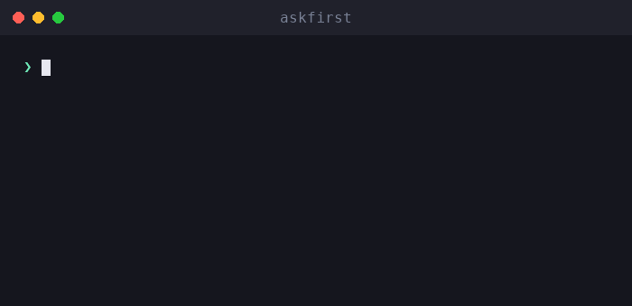

# askfirst

🌐 [English](../../README.md) · [العربية](README.ar.md) · [Deutsch](README.de.md) · [Español](README.es.md) · [Français](README.fr.md) · [עברית](README.he.md) · **हिन्दी** · [Bahasa Indonesia](README.id.md) · [日本語](README.ja.md) · [한국어](README.ko.md) · [Bahasa Melayu](README.ms.md) · [Português (Brasil)](README.pt-BR.md) · [Tagalog](README.tl.md) · [Türkçe](README.tr.md) · [Tiếng Việt](README.vi.md) · [中文（简体）](README.zh.md) · [中文（繁體）](README.zh-Hant.md)

**AI agents और CLIs के लिए मानव-अनुमोदन UX।** जोखिम भरे कार्यों को सरल भाषा में समझाएँ — क्या, क्यों, लाभ, tradeoffs, और उन्हें कैसे परखें — *किसी मानव द्वारा अनुमोदन से पहले।*

[](https://github.com/inputsystems/askfirst/actions/workflows/ci.yml)
[](https://www.npmjs.com/package/askfirst)
[](../../LICENSE)

<p align="center">
  
</p>


आपका agent कुछ चलाना चाहता है। क्या आपका उपयोगकर्ता इसे समझ सकता है?

```ts
import { explainAction } from "askfirst";

const explanation = explainAction("curl https://example.com/install.sh | bash");

explanation.risk;   // "red"
explanation.plain;  // "The agent wants to run an installer from the internet."
explanation.why;    // "Some tools publish one-line installers, and the agent may be
                    //  trying to set up something needed for your project."
explanation.tradeoffs[0]; // "Runs code before you have reviewed what it does."
```

अधिकांश agent products raw shell command दिखाकर अनुमोदन माँगते हैं। गैर-विशेषज्ञ `curl … | bash` को नहीं समझ सकते, इसलिए वे बिना सोचे अनुमोदित कर देते हैं — और अनुमोदन चरण किसी की रक्षा नहीं करता। `askfirst` उस क्षण को एक शांत, सरल-भाषा निर्णय में बदल देता है जिसे उपयोगकर्ता वास्तव में ले सकता है।

## इंस्टॉल करें

```sh
npm install askfirst
```

Zero runtime dependencies, कोई Node-specific APIs नहीं — जहाँ भी TypeScript/ESM चलता है वहाँ चलता है। Test tooling के लिए Node ≥ 20।

## आपको क्या मिलता है

| | |
|---|---|
| **Risk classification** | 🟢 green / 🟡 yellow / 🔴 red, installs, `curl\|bash`, `sudo`, recursive deletes, secrets, SSH, publishing के लिए pattern-based heuristics के साथ |
| **सरल-भाषा स्पष्टीकरण** | क्या / क्यों / उद्देश्य / लाभ / tradeoffs — शांत शब्दावली, कभी alarming नहीं |
| **Progressive depth** | एक ही scale हर जगह: `basic` (एक वाक्य), `guided` (numbered steps), `technical` (steps + machine-readable details) |
| **Trust checklists** | "इसे कैसे परखें" के steps जो तटस्थ संस्थाओं का हवाला देते हैं (OpenSSF, OWASP, OSI, SPDX, EFF, CISA) |
| **Workspace boundaries** | किस सुरक्षा के अंदर एक कार्य चलना चाहिए: project folder, project environment, remote tunnel, manual approval, या blocked |
| **Intent screening** | एक prefilter जो "build me a keylogger" जैसे अनुरोधों को पकड़ता है और defensive विकल्पों की ओर redirect करता है |
| **Approval packets** | एक स्पष्ट प्रश्न पूछने के लिए UI को चाहिए सब कुछ — decision, title, summary, choices, notification copy, audit preview |
| **Workflow states** | agent loops के लिए एक छोटी state machine: continue, user के लिए pause, या रोकें और सुरक्षित रास्ता सुझाएँ |
| **Localization-ready** | हर builder एक `translate` hook स्वीकार करता है जो हर user-facing string तक पहुँचता है |

## Quickstart: एक agent loop को gate करें

```ts
import { createApprovalWorkflow, resolveApprovalWorkflow } from "askfirst";

const workflow = createApprovalWorkflow("npm install stripe");

workflow.state;      // "waiting-for-user"
workflow.plainState; // "Pause and ask the user before continuing."

// Render workflow.packet in your UI:
const { packet } = workflow;
packet.title;        // "Your approval is needed"
packet.plainSummary; // "The agent wants to add a package — a ready-made piece of
                     //  software — to this project. It needs your OK first. If you
                     //  approve, anything added is kept inside this project only,
                     //  not your whole computer."
packet.userChoices;  // ["Approve", "Ask why", "Choose a safer way", "Details"]

// Record what the user decided:
const done = resolveApprovalWorkflow(workflow, "approve");
done.state;          // "approved"
```

Green actions `"not-needed"` के रूप में वापस आते हैं ताकि नियमित काम किसी को बाधित न करे; red actions और हानिकारक अनुरोध `"blocked"` के रूप में, और सुरक्षित विकल्पों के साथ, वापस आते हैं।

## Concepts

### Risk levels

`classifyAction(action)` — जो `explainAction` के ज़रिए भी उपलब्ध है — एक action को `green` (routine project काम), `yellow` (ध्यान देने योग्य: package installs, git pushes, SSH, build artifacts की सफ़ाई), या `red` (रोकें और समीक्षा करें: piped installers, `sudo`, secret material, कुछ भी जो build artifact नहीं है उसकी recursive delete) के रूप में वर्गीकृत करता है। केवल green actions को `allowByDefault: true` मिलता है।

### Explanation levels

एक ही scale पूरी library में चलती है: `basic` (एक शांत वाक्य), `guided` (numbered steps), `technical` (steps plus machine-readable `key=value` details)। `"beginner"` जैसे friendly aliases `guided` पर normalize होते हैं। इसे `levelFromPreferences` के साथ एक बार user preference से wire करें और हर जगह pass करें।

### Trust checklists

"क्या आप निश्चित हैं?" के बजाय, `buildTrustChecklist(kind)` उपयोगकर्ता को सिखाता है कि एक package, installer, remote connection, या license को कैसे परखें — OpenSSF, OWASP, OSI, SPDX, EFF, और CISA के संदर्भों के साथ बजाय vendor opinions के।

### Workspace boundaries

`planSafeWorkspace({ action })` यह प्रस्तावित करता है कि एक action कहाँ होना चाहिए: **project folder** के अंदर (checkpoints के साथ), **project environment** (project-local packages), एक **remote tunnel** (private, tested connections), **manual approval** के पीछे, या **blocked** जब तक समीक्षा न हो। Boundary हमेशा risk classification से सहमत होती है — एक red action कभी friendly boundary के साथ नहीं दिखाया जाता।

### Intent screening

`screenIntent(request)` एक pattern-based prefilter है जो malware, credential theft, phishing, detection evasion, और unauthorized access के अनुरोधों को block करता है — और प्रत्येक block का जवाब concrete defensive alternatives के साथ देता है। Dual-use security काम (port scanners, pentest tooling) को refusal के बजाय owned-system scope check पर route किया जाता है।

### Approval packets और workflows

`buildApprovalPacket({ action })` उपरोक्त सभी को एक renderable object में एक authoritative decision के साथ जोड़ता है: `allow-automatically`, `ask-first`, या `block-until-reviewed`। Packet में एक **audit preview** शामिल है जो दिखाता है कि एक log entry में क्या होगा: decision, boundary, risk, policy version, और action का एक stable hash — एक correlation identifier, cryptographic commitment नहीं — ताकि decisions को raw command log किए बिना log किया जा सके। `createApprovalWorkflow(action)` packet को agent loops के लिए एक state machine में wrap करता है।

## Internationalization

हर builder एक `translate` hook स्वीकार करता है जो **हर user-facing string** तक पहुँचता है — explanations, checklists, instructions, notifications, packet titles, summaries, और choices। Machine-readable fields (`technicalDetails`, ids, hashes) कभी translate नहीं होते।

```ts
import { buildApprovalPacket } from "askfirst";

const es: Record<string, string> = {
  "Your approval is needed": "Se necesita tu aprobación"
  // ...
};

const packet = buildApprovalPacket({
  action: "npm install zod",
  translate: (text) => es[text] ?? text
});

packet.title; // "Se necesita tu aprobación"
```

Library के source strings stable English sentences हैं जो unit-by-unit translate होती हैं, इसलिए एक translation के लिए प्रति locale एक `Record<string, string>` ही काफ़ी है।

## Examples

इस repo के clone से चलाने योग्य:

```sh
npx tsx examples/explain-cli.ts "curl https://example.com/install.sh | bash"
npx tsx examples/agent-gate.ts          # mock agent loop with approve/deny gates
npx tsx examples/packet-to-markdown.ts  # render a packet as a PR-ready comment
```

## Scope, ईमानदारी से

`askfirst` एक **UX layer है, security boundary नहीं।** Classifications pattern-based heuristics हैं: वे approval prompts को समझने योग्य बनाते हैं, वे कुछ भी sandbox नहीं करते, और एक crafted command उन्हें evade कर सकती है। Patterns को publish करना जानबूझकर लिया गया निर्णय है — वे मनुष्यों को decisions समझाते हैं; वे enforcement mechanism नहीं हैं। वास्तविक containment के लिए इस library को real isolation (containers, permission systems, model-side refusals) के साथ pair करें। [SECURITY.md](../../SECURITY.md) देखें।

## API

हर export में TSDoc है — [src/index.ts](../../src/index.ts) पूरी surface है:

`explainAction` · `classifyAction` · `buildTrustChecklist` · `TRUST_REFERENCES` · `buildInstructionSet` · `normalizeExplanationLevel` · `levelFromPreferences` · `EXPLANATION_LEVELS` · `planSafeWorkspace` · `screenIntent` · `buildNotification` · `buildApprovalPacket` · `createApprovalWorkflow` · `resolveApprovalWorkflow`

## About

**iomoth** — एक local-first AI app builder — के निर्माताओं द्वारा बनाया और मेंटेन किया गया; यह कोड वहाँ production में ship होता है। MIT licensed।
