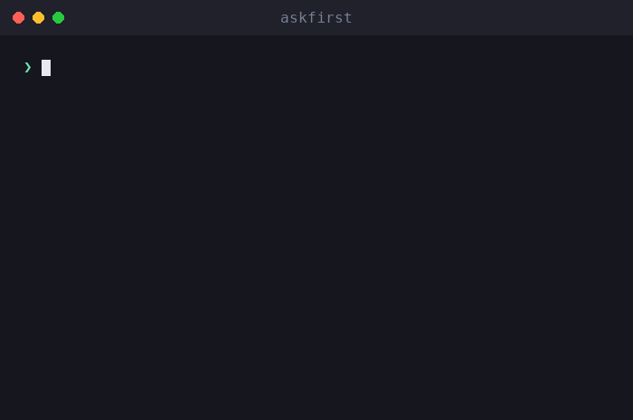

# askfirst

🌐 [English](../../README.md) · [العربية](README.ar.md) · [Deutsch](README.de.md) · [Español](README.es.md) · [Français](README.fr.md) · [עברית](README.he.md) · [हिन्दी](README.hi.md) · **Bahasa Indonesia** · [日本語](README.ja.md) · [한국어](README.ko.md) · [Bahasa Melayu](README.ms.md) · [Português (Brasil)](README.pt-BR.md) · [Tagalog](README.tl.md) · [Türkçe](README.tr.md) · [Tiếng Việt](README.vi.md) · [中文（简体）](README.zh.md) · [中文（繁體）](README.zh-Hant.md)

**UX persetujuan manusia untuk agen AI dan CLI.** Jelaskan tindakan berisiko dalam bahasa sederhana — apa, mengapa, manfaat, konsekuensi, dan cara menilainya — *sebelum* manusia menyetujuinya.

[](https://github.com/inputsystems/askfirst/actions/workflows/ci.yml)
[](https://www.npmjs.com/package/askfirst)
[](../../LICENSE)

<p align="center">
  
</p>


Agen Anda ingin menjalankan sesuatu. Apakah pengguna Anda dapat memahaminya?

```ts
import { explainAction } from "askfirst";

const explanation = explainAction("curl https://example.com/install.sh | bash");

explanation.risk;   // "red"
explanation.plain;  // "The agent wants to run an installer from the internet."
explanation.why;    // "Some tools publish one-line installers, and the agent may be
                    //  trying to set up something needed for your project."
explanation.tradeoffs[0]; // "Runs code before you have reviewed what it does."
```

Sebagian besar produk agen meminta persetujuan dengan menampilkan perintah shell mentah. Pengguna non-ahli tidak bisa mengevaluasi `curl … | bash`, sehingga mereka langsung menyetujuinya — dan langkah persetujuan itu tidak melindungi siapa pun. `askfirst` mengubah momen itu menjadi keputusan dalam bahasa sederhana yang benar-benar bisa diambil pengguna.

## Instalasi

```sh
npm install askfirst
```

Tanpa dependensi runtime, tanpa API khusus Node — berjalan di mana saja TypeScript/ESM berjalan. Node ≥ 20 untuk alat pengujian.

## Apa yang Anda dapatkan

| | |
|---|---|
| **Klasifikasi risiko** | 🟢 hijau / 🟡 kuning / 🔴 merah, dengan heuristik berbasis pola untuk instalasi, `curl\|bash`, `sudo`, penghapusan rekursif, rahasia, SSH, penerbitan |
| **Penjelasan bahasa sederhana** | apa / mengapa / tujuan / manfaat / konsekuensi — penulisan yang tenang, tidak mengkhawatirkan |
| **Kedalaman progresif** | satu skala di seluruh perpustakaan: `basic` (satu kalimat), `guided` (langkah bernomor), `technical` (langkah + detail yang dapat dibaca mesin) |
| **Daftar periksa kepercayaan** | langkah "cara menilai ini" yang mengutip lembaga netral (OpenSSF, OWASP, OSI, SPDX, EFF, CISA) |
| **Batas ruang kerja** | perlindungan mana yang harus dijalankan suatu tindakan: folder proyek, lingkungan proyek, terowongan jarak jauh, persetujuan manual, atau diblokir |
| **Penyaringan maksud** | prafilter yang menangkap permintaan bergaya "buatkan saya keylogger" dan mengarahkan ke alternatif defensif |
| **Paket persetujuan** | semua yang dibutuhkan UI untuk mengajukan satu pertanyaan yang jelas — keputusan, judul, ringkasan, pilihan, salinan notifikasi, pratinjau audit |
| **Status alur kerja** | mesin status kecil untuk loop agen: lanjutkan, jeda untuk pengguna, atau berhenti dan tawarkan jalur yang lebih aman |
| **Siap lokalisasi** | setiap builder menerima hook `translate` yang menjangkau setiap string yang terlihat pengguna |

## Mulai Cepat: gating loop agen

```ts
import { createApprovalWorkflow, resolveApprovalWorkflow } from "askfirst";

const workflow = createApprovalWorkflow("npm install stripe");

workflow.state;      // "waiting-for-user"
workflow.plainState; // "Pause and ask the user before continuing."

// Render workflow.packet in your UI:
const { packet } = workflow;
packet.title;        // "Your approval is needed"
packet.plainSummary; // "The agent wants to add a package — a ready-made piece of
                     //  software — to this project. It needs your OK first. If you
                     //  approve, anything added is kept inside this project only,
                     //  not your whole computer."
packet.userChoices;  // ["Approve", "Ask why", "Choose a safer way", "Details"]

// Record what the user decided:
const done = resolveApprovalWorkflow(workflow, "approve");
done.state;          // "approved"
```

Tindakan hijau dikembalikan sebagai `"not-needed"` sehingga pekerjaan rutin tidak pernah mengganggu siapa pun; tindakan merah dan permintaan berbahaya dikembalikan sebagai `"blocked"` dengan pilihan yang lebih aman terlampir.

## Konsep

### Tingkat risiko

`classifyAction(action)` — juga tersedia melalui `explainAction` — mengklasifikasikan tindakan sebagai `green` (pekerjaan proyek rutin), `yellow` (layak dilihat: instalasi paket, git push, SSH, membersihkan artefak build), atau `red` (berhenti dan tinjau: penginstal yang dipipe, `sudo`, materi rahasia, penghapusan rekursif dari apa pun yang bukan artefak build). Hanya tindakan hijau yang mendapatkan `allowByDefault: true`.

### Tingkat penjelasan

Satu skala berjalan di seluruh perpustakaan: `basic` (satu kalimat yang tenang), `guided` (langkah bernomor), `technical` (langkah ditambah detail `key=value` yang dapat dibaca mesin). Alias ramah seperti `"beginner"` dinormalisasi ke `guided`. Hubungkan ke preferensi pengguna sekali dengan `levelFromPreferences` dan gunakan di mana saja.

### Daftar periksa kepercayaan

Alih-alih "apakah Anda yakin?", `buildTrustChecklist(kind)` mengajarkan pengguna cara menilai paket, penginstal, koneksi jarak jauh, atau lisensi — dengan referensi ke OpenSSF, OWASP, OSI, SPDX, EFF, dan CISA alih-alih pendapat vendor.

### Batas ruang kerja

`planSafeWorkspace({ action })` mengusulkan di mana suatu tindakan harus dijalankan: di dalam **folder proyek** (dengan titik pemulihan), **lingkungan proyek** (paket lokal proyek), **terowongan jarak jauh** (koneksi privat dan teruji), di balik **persetujuan manual**, atau **diblokir** hingga ditinjau. Batas selalu sepakat dengan klasifikasi risiko — tindakan merah tidak pernah disajikan dengan batas yang ramah.

### Penyaringan maksud

`screenIntent(request)` adalah prafilter berbasis pola yang memblokir permintaan untuk perangkat lunak berbahaya, pencurian kredensial, phishing, penghindaran deteksi, dan akses tidak sah — dan menjawab setiap blokir dengan alternatif defensif yang konkret. Pekerjaan keamanan dual-use (pemindai port, alat pentest) diarahkan ke pemeriksaan cakupan sistem yang dimiliki alih-alih penolakan.

### Paket persetujuan dan alur kerja

`buildApprovalPacket({ action })` merakit semua hal di atas menjadi satu objek yang dapat dirender dengan keputusan otoritatif: `allow-automatically`, `ask-first`, atau `block-until-reviewed`. Paket menyertakan **pratinjau audit** yang menunjukkan apa yang akan dimuat entri log: keputusan, batas, risiko, versi kebijakan, dan hash stabil dari tindakan — pengenal korelasi, bukan komitmen kriptografis — sehingga keputusan dapat dicatat tanpa mencatat perintah mentah. `createApprovalWorkflow(action)` membungkus paket dalam mesin status untuk loop agen.

## Internasionalisasi

Setiap builder menerima hook `translate` yang menjangkau **setiap string yang terlihat pengguna** — penjelasan, daftar periksa, instruksi, notifikasi, judul paket, ringkasan, dan pilihan. Bidang yang dapat dibaca mesin (`technicalDetails`, id, hash) tidak pernah diterjemahkan.

```ts
import { buildApprovalPacket } from "askfirst";

const es: Record<string, string> = {
  "Your approval is needed": "Se necesita tu aprobación"
  // ...
};

const packet = buildApprovalPacket({
  action: "npm install zod",
  translate: (text) => es[text] ?? text
});

packet.title; // "Se necesita tu aprobación"
```

String sumber perpustakaan adalah kalimat bahasa Inggris yang stabil diterjemahkan per unit, sehingga `Record<string, string>` per lokal adalah semua yang dibutuhkan terjemahan.

## Contoh

Dapat dijalankan dari klon repo ini:

```sh
npx tsx examples/explain-cli.ts "curl https://example.com/install.sh | bash"
npx tsx examples/agent-gate.ts          # mock agent loop with approve/deny gates
npx tsx examples/packet-to-markdown.ts  # render a packet as a PR-ready comment
```

## Cakupan, secara jujur

`askfirst` adalah **lapisan UX, bukan batas keamanan**. Klasifikasi berbasis heuristik pola: klasifikasi membuat prompt persetujuan dapat dipahami, tidak menyandbox apa pun, dan perintah yang dibuat dapat menghindarinya. Menerbitkan pola adalah pilihan yang disengaja — pola menjelaskan keputusan kepada manusia; pola bukan mekanisme penegakan. Padukan perpustakaan ini dengan isolasi nyata (container, sistem izin, penolakan sisi model) untuk penahanan yang sebenarnya. Lihat [SECURITY.md](../../SECURITY.md).

## API

Setiap ekspor membawa TSDoc — [src/index.ts](../../src/index.ts) adalah permukaan lengkapnya:

`explainAction` · `classifyAction` · `buildTrustChecklist` · `TRUST_REFERENCES` · `buildInstructionSet` · `normalizeExplanationLevel` · `levelFromPreferences` · `EXPLANATION_LEVELS` · `planSafeWorkspace` · `screenIntent` · `buildNotification` · `buildApprovalPacket` · `createApprovalWorkflow` · `resolveApprovalWorkflow`

## Tentang

Dibangun dan dipelihara oleh para pembuat **iomoth**, pembangun aplikasi AI yang mengutamakan lokal — kode ini dikirim dalam produksi di sana. Berlisensi MIT.
