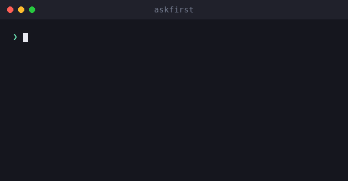

# askfirst

🌐 [English](../../README.md) · [العربية](README.ar.md) · [Deutsch](README.de.md) · [Español](README.es.md) · [Français](README.fr.md) · [עברית](README.he.md) · [हिन्दी](README.hi.md) · [Bahasa Indonesia](README.id.md) · **日本語** · [한국어](README.ko.md) · [Bahasa Melayu](README.ms.md) · [Português (Brasil)](README.pt-BR.md) · [Tagalog](README.tl.md) · [Türkçe](README.tr.md) · [Tiếng Việt](README.vi.md) · [中文（简体）](README.zh.md) · [中文（繁體）](README.zh-Hant.md)

**AIエージェントとCLIのための人間による承認UX。** リスクのあるアクションを実行前に平易な言葉で説明します — 何を、なぜ、メリット、トレードオフ、判断のポイントを — *人間が承認する前に*。

[](https://github.com/inputsystems/askfirst/actions/workflows/ci.yml)
[](https://www.npmjs.com/package/askfirst)
[](../../LICENSE)

<p align="center">
  
</p>


あなたのエージェントが何かを実行しようとしています。ユーザーはそれを理解できますか？

```ts
import { explainAction } from "askfirst";

const explanation = explainAction("curl https://example.com/install.sh | bash");

explanation.risk;   // "red"
explanation.plain;  // "The agent wants to run an installer from the internet."
explanation.why;    // "Some tools publish one-line installers, and the agent may be
                    //  trying to set up something needed for your project."
explanation.tradeoffs[0]; // "Runs code before you have reviewed what it does."
```

多くのエージェント製品は、生のシェルコマンドを表示して承認を求めます。専門知識のないユーザーは `curl … | bash` を評価できないため、形式的に承認してしまいます — そうなると承認ステップは誰も守りません。`askfirst` はその瞬間を、ユーザーが実際に判断できる、落ち着いた平易な言葉による意思決定の場に変えます。

## インストール

```sh
npm install askfirst
```

ランタイム依存関係ゼロ、Node固有のAPIなし — TypeScript/ESMが動作する場所ならどこでも動きます。テストツールにはNode ≥ 20が必要です。

## 提供される機能

| | |
|---|---|
| **リスク分類** | 🟢 グリーン / 🟡 イエロー / 🔴 レッド。インストール、`curl\|bash`、`sudo`、再帰的削除、シークレット、SSH、公開操作などをパターンに基づいてヒューリスティック判定 |
| **平易な言葉による説明** | 何を・なぜ・目的・メリット・トレードオフ — 落ち着いた言葉遣いで、決して大げさにならない |
| **段階的な詳細度** | 一貫したスケール：`basic`（1文）、`guided`（番号付き手順）、`technical`（手順＋機械可読な詳細） |
| **信頼チェックリスト** | 「このアクションをどう判断するか」の手順を、中立的な機関（OpenSSF、OWASP、OSI、SPDX、EFF、CISA）を引用して提示 |
| **ワークスペース境界** | アクションを実行すべき保護範囲：プロジェクトフォルダー、プロジェクト環境、リモートトンネル、手動承認、またはブロック |
| **意図スクリーニング** | 「キーロガーを作って」スタイルのリクエストをキャッチし、防御的な代替手段にリダイレクトするプレフィルター |
| **承認パケット** | 明確な1つの質問をUIに問いかけるために必要なすべて — 決定、タイトル、要約、選択肢、通知文、監査プレビュー |
| **ワークフロー状態** | エージェントループ向けの小さなステートマシン：続行、ユーザーに一時停止、またはより安全なパスを提案して停止 |
| **ローカライズ対応** | すべてのビルダーはユーザー向け文字列すべてに届く `translate` フックを受け付ける |

## クイックスタート：エージェントループにゲートを設ける

```ts
import { createApprovalWorkflow, resolveApprovalWorkflow } from "askfirst";

const workflow = createApprovalWorkflow("npm install stripe");

workflow.state;      // "waiting-for-user"
workflow.plainState; // "Pause and ask the user before continuing."

// Render workflow.packet in your UI:
const { packet } = workflow;
packet.title;        // "Your approval is needed"
packet.plainSummary; // "The agent wants to add a package — a ready-made piece of
                     //  software — to this project. It needs your OK first. If you
                     //  approve, anything added is kept inside this project only,
                     //  not your whole computer."
packet.userChoices;  // ["Approve", "Ask why", "Choose a safer way", "Details"]

// Record what the user decided:
const done = resolveApprovalWorkflow(workflow, "approve");
done.state;          // "approved"
```

グリーンのアクションは `"not-needed"` として返ってくるため、日常的な作業が誰かを中断することはありません。レッドのアクションや有害なリクエストは `"blocked"` として返り、より安全な選択肢が付与されます。

## コンセプト

### リスクレベル

`classifyAction(action)` — `explainAction` 経由でも利用可能 — アクションを `green`（日常的なプロジェクト作業）、`yellow`（要確認：パッケージインストール、git push、SSH、ビルド成果物のクリーンアップ）、または `red`（停止してレビュー：パイプインストーラー、`sudo`、シークレット素材、ビルド成果物以外の再帰削除）に分類します。`allowByDefault: true` はグリーンのアクションのみに付与されます。

### 説明レベル

ライブラリ全体に1つのスケールが通っています：`basic`（落ち着いた1文）、`guided`（番号付き手順）、`technical`（手順＋機械可読な `key=value` 詳細）。`"beginner"` のようなフレンドリーなエイリアスは `guided` に正規化されます。`levelFromPreferences` でユーザー設定を一度ワイヤリングすれば、どこにでも渡せます。

### 信頼チェックリスト

「本当によろしいですか？」の代わりに、`buildTrustChecklist(kind)` はパッケージ、インストーラー、リモート接続、またはライセンスの判断方法をユーザーに教えます — ベンダーの意見ではなく、OpenSSF、OWASP、OSI、SPDX、EFF、CISAへの参照を示しながら。

### ワークスペース境界

`planSafeWorkspace({ action })` はアクションの適切な実行場所を提案します：**プロジェクトフォルダー**内（チェックポイント付き）、**プロジェクト環境**（プロジェクトローカルパッケージ）、**リモートトンネル**（プライベートでテスト済みの接続）、**手動承認**の背後、または**ブロック**してレビュー待ち。境界は必ずリスク分類と一致します — レッドのアクションにフレンドリーな境界が表示されることはありません。

### 意図スクリーニング

`screenIntent(request)` はマルウェア、認証情報の窃取、フィッシング、検出回避、不正アクセスのリクエストをブロックするパターンベースのプレフィルターです。各ブロックには具体的な防御的代替手段が付与されます。デュアルユースのセキュリティ作業（ポートスキャナー、ペンテストツール）は拒否ではなく所有システムの範囲確認にルーティングされます。

### 承認パケットとワークフロー

`buildApprovalPacket({ action })` は上記すべてを1つのレンダリング可能なオブジェクトにまとめ、権威ある決定を付与します：`allow-automatically`、`ask-first`、または `block-until-reviewed`。パケットには**監査プレビュー**が含まれており、ログエントリーに含まれる内容を示します：決定、境界、リスク、ポリシーバージョン、およびアクションの安定したハッシュ — 相関識別子であり、暗号的なコミットメントではありません — これにより生のコマンドをログに記録せずに決定を記録できます。`createApprovalWorkflow(action)` はパケットをエージェントループ向けのステートマシンでラップします。

## 国際化

すべてのビルダーは **ユーザー向け文字列すべて** に届く `translate` フックを受け付けます — 説明、チェックリスト、指示、通知、パケットのタイトル、要約、選択肢。機械可読なフィールド（`technicalDetails`、id、ハッシュ）は翻訳されません。

```ts
import { buildApprovalPacket } from "askfirst";

const es: Record<string, string> = {
  "Your approval is needed": "Se necesita tu aprobación"
  // ...
};

const packet = buildApprovalPacket({
  action: "npm install zod",
  translate: (text) => es[text] ?? text
});

packet.title; // "Se necesita tu aprobación"
```

ライブラリのソース文字列は安定した英語の文章であり、1文字列ずつ翻訳されます。そのためロケールごとに `Record<string, string>` があれば翻訳に必要なものはすべて揃います。

## サンプル

このリポジトリをクローンすれば実行できます：

```sh
npx tsx examples/explain-cli.ts "curl https://example.com/install.sh | bash"
npx tsx examples/agent-gate.ts          # mock agent loop with approve/deny gates
npx tsx examples/packet-to-markdown.ts  # render a packet as a PR-ready comment
```

## 正直なスコープ説明

`askfirst` は **UXレイヤーであり、セキュリティ境界ではありません**。分類はパターンベースのヒューリスティックです。承認プロンプトをわかりやすくするものであり、サンドボックス化はしておらず、巧妙なコマンドはこれを回避できます。パターンを公開するのは意図的な選択です — 人間への意思決定の説明であり、強制メカニズムではありません。実際の封じ込めには、このライブラリと本物の分離（コンテナ、権限システム、モデル側の拒否）を組み合わせてください。[SECURITY.md](../../SECURITY.md) を参照してください。

## API

すべてのエクスポートはTSDocを持っています — [src/index.ts](../../src/index.ts) が完全なサーフェスです：

`explainAction` · `classifyAction` · `buildTrustChecklist` · `TRUST_REFERENCES` · `buildInstructionSet` · `normalizeExplanationLevel` · `levelFromPreferences` · `EXPLANATION_LEVELS` · `planSafeWorkspace` · `screenIntent` · `buildNotification` · `buildApprovalPacket` · `createApprovalWorkflow` · `resolveApprovalWorkflow`

## このライブラリについて

**iomoth**（ローカルファーストのAIアプリビルダー）の開発者が構築・メンテナンスしており、このコードは本番環境で使用されています。MITライセンス。
