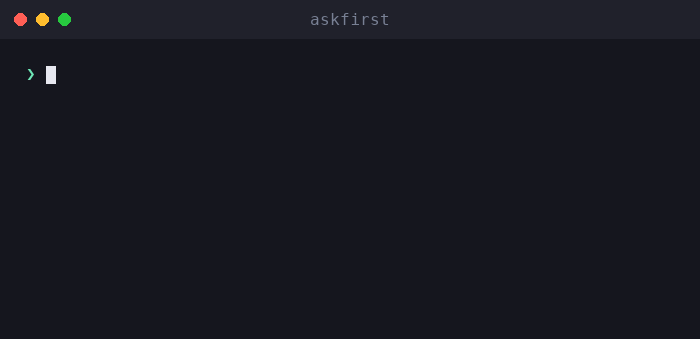

# askfirst

🌐 [English](../../README.md) · [العربية](README.ar.md) · [Deutsch](README.de.md) · [Español](README.es.md) · [Français](README.fr.md) · [עברית](README.he.md) · [हिन्दी](README.hi.md) · [Bahasa Indonesia](README.id.md) · [日本語](README.ja.md) · **한국어** · [Bahasa Melayu](README.ms.md) · [Português (Brasil)](README.pt-BR.md) · [Tagalog](README.tl.md) · [Türkçe](README.tr.md) · [Tiếng Việt](README.vi.md) · [中文（简体）](README.zh.md) · [中文（繁體）](README.zh-Hant.md)

**AI 에이전트 및 CLI를 위한 사람의 승인 UX.** 위험한 작업을 실행하기 *전에* 사람이 승인할 수 있도록 — 무엇인지, 왜인지, 이점, 절충안, 판단 방법까지 — 쉬운 언어로 설명합니다.

[](https://github.com/inputsystems/askfirst/actions/workflows/ci.yml)
[](https://www.npmjs.com/package/askfirst)
[](../../LICENSE)

<p align="center">
  
</p>


에이전트가 무언가를 실행하려 합니다. 사용자가 그것을 이해할 수 있을까요?

```ts
import { explainAction } from "askfirst";

const explanation = explainAction("curl https://example.com/install.sh | bash");

explanation.risk;   // "red"
explanation.plain;  // "The agent wants to run an installer from the internet."
explanation.why;    // "Some tools publish one-line installers, and the agent may be
                    //  trying to set up something needed for your project."
explanation.tradeoffs[0]; // "Runs code before you have reviewed what it does."
```

대부분의 에이전트 제품은 원시 셸 명령을 보여주며 승인을 요청합니다. 비전문가는 `curl … | bash`를 평가할 수 없으므로 형식적으로 승인하게 되고 — 승인 단계가 아무도 보호하지 못합니다. `askfirst`는 그 순간을 사용자가 실제로 결정할 수 있는 차분하고 쉬운 언어의 의사결정으로 바꿉니다.

## 설치

```sh
npm install askfirst
```

런타임 의존성 없음, Node 전용 API 없음 — TypeScript/ESM이 실행되는 어디서든 작동합니다. 테스트 도구를 위해 Node ≥ 20이 필요합니다.

## 제공 기능

| | |
|---|---|
| **위험 분류** | 🟢 녹색 / 🟡 노란색 / 🔴 빨간색, 설치, `curl\|bash`, `sudo`, 재귀 삭제, 비밀, SSH, 게시에 대한 패턴 기반 휴리스틱 |
| **쉬운 언어 설명** | 무엇인지 / 왜인지 / 목적 / 이점 / 절충안 — 차분한 표현, 절대 과장하거나 겁주지 않음 |
| **점진적 깊이** | 전체에 걸쳐 하나의 척도: `basic`(한 문장), `guided`(번호가 매겨진 단계), `technical`(단계 + 기계 판독 가능한 세부 정보) |
| **신뢰 체크리스트** | 중립 기관(OpenSSF, OWASP, OSI, SPDX, EFF, CISA)을 인용하여 패키지, 설치 프로그램, 원격 연결 또는 라이선스를 판단하는 방법을 알려주는 "이렇게 판단하세요" 단계 |
| **작업 공간 경계** | 작업이 실행되어야 할 보호 범위: 프로젝트 폴더, 프로젝트 환경, 원격 터널, 수동 승인 또는 차단 |
| **의도 검사** | "키로거를 만들어줘" 스타일의 요청을 감지하고 방어적 대안으로 리디렉션하는 사전 필터 |
| **승인 패킷** | UI가 명확한 질문 하나를 하는 데 필요한 모든 것 — 결정, 제목, 요약, 선택 항목, 알림 문구, 감사 미리보기 |
| **워크플로 상태** | 에이전트 루프를 위한 소형 상태 머신: 계속, 사용자를 위해 일시 중지, 또는 중지하고 더 안전한 경로 제안 |
| **현지화 준비됨** | 모든 빌더는 모든 사용자 대면 문자열에 도달하는 `translate` 훅을 허용합니다 |

## 빠른 시작: 에이전트 루프 게이팅

```ts
import { createApprovalWorkflow, resolveApprovalWorkflow } from "askfirst";

const workflow = createApprovalWorkflow("npm install stripe");

workflow.state;      // "waiting-for-user"
workflow.plainState; // "Pause and ask the user before continuing."

// Render workflow.packet in your UI:
const { packet } = workflow;
packet.title;        // "Your approval is needed"
packet.plainSummary; // "The agent wants to add a package — a ready-made piece of
                     //  software — to this project. It needs your OK first. If you
                     //  approve, anything added is kept inside this project only,
                     //  not your whole computer."
packet.userChoices;  // ["Approve", "Ask why", "Choose a safer way", "Details"]

// Record what the user decided:
const done = resolveApprovalWorkflow(workflow, "approve");
done.state;          // "approved"
```

녹색 작업은 `"not-needed"`로 반환되어 일상적인 작업이 누구도 방해하지 않습니다. 빨간색 작업과 유해한 요청은 더 안전한 선택 항목이 첨부된 `"blocked"`로 반환됩니다.

## 개념

### 위험 수준

`classifyAction(action)` — `explainAction`을 통해서도 노출됨 — 작업을 `green`(일상적인 프로젝트 작업), `yellow`(확인이 필요함: 패키지 설치, git 푸시, SSH, 빌드 아티팩트 정리), 또는 `red`(중지하고 검토: 파이프 설치 프로그램, `sudo`, 비밀 자료, 빌드 아티팩트가 아닌 것의 재귀 삭제)로 분류합니다. 녹색 작업만 `allowByDefault: true`를 얻습니다.

### 설명 수준

하나의 척도가 전체 라이브러리에 걸쳐 실행됩니다: `basic`(차분한 한 문장), `guided`(번호가 매겨진 단계), `technical`(단계 및 기계 판독 가능한 `key=value` 세부 정보). `"beginner"`와 같은 친근한 별칭은 `guided`로 정규화됩니다. `levelFromPreferences`로 사용자 기본 설정에 한 번 연결하고 어디서나 전달하세요.

### 신뢰 체크리스트

"정말로요?"라고 묻는 대신, `buildTrustChecklist(kind)`는 사용자에게 패키지, 설치 프로그램, 원격 연결 또는 라이선스를 판단하는 방법을 가르칩니다 — 벤더 의견 대신 OpenSSF, OWASP, OSI, SPDX, EFF, CISA에 대한 참조와 함께.

### 작업 공간 경계

`planSafeWorkspace({ action })`은 작업이 어디에 속하는지 제안합니다: **프로젝트 폴더** 안(체크포인트와 함께), **프로젝트 환경**(프로젝트 로컬 패키지), **원격 터널**(비공개, 테스트된 연결), **수동 승인** 뒤, 또는 검토될 때까지 **차단됨**. 경계는 항상 위험 분류와 일치합니다 — 빨간색 작업은 결코 친근한 경계로 표시되지 않습니다.

### 의도 검사

`screenIntent(request)`는 악성 소프트웨어, 자격증명 도용, 피싱, 탐지 회피, 무단 접근을 위한 요청을 차단하는 패턴 기반 사전 필터이며 — 각 차단에 구체적인 방어적 대안으로 답변합니다. 이중 사용 보안 작업(포트 스캐너, 침투 테스트 도구)은 거부 대신 소유 시스템 범위 확인으로 라우팅됩니다.

### 승인 패킷 및 워크플로

`buildApprovalPacket({ action })`은 위의 모든 것을 권위 있는 결정이 포함된 하나의 렌더링 가능한 객체로 조합합니다: `allow-automatically`, `ask-first`, 또는 `block-until-reviewed`. 패킷에는 로그 항목에 포함될 내용을 보여주는 **감사 미리보기**가 포함됩니다: 결정, 경계, 위험, 정책 버전, 작업의 안정적인 해시 — 암호화 커밋이 아닌 상관 식별자 — 원시 명령을 기록하지 않고도 결정을 로그할 수 있습니다. `createApprovalWorkflow(action)`은 에이전트 루프를 위한 상태 머신으로 패킷을 래핑합니다.

## 국제화

모든 빌더는 **모든 사용자 대면 문자열**에 도달하는 `translate` 훅을 허용합니다 — 설명, 체크리스트, 지침, 알림, 패킷 제목, 요약, 선택 항목. 기계 판독 가능한 필드(`technicalDetails`, id, 해시)는 절대 번역되지 않습니다.

```ts
import { buildApprovalPacket } from "askfirst";

const es: Record<string, string> = {
  "Your approval is needed": "Se necesita tu aprobación"
  // ...
};

const packet = buildApprovalPacket({
  action: "npm install zod",
  translate: (text) => es[text] ?? text
});

packet.title; // "Se necesita tu aprobación"
```

라이브러리의 소스 문자열은 단위별로 번역된 안정적인 영어 문장이므로, 로케일당 `Record<string, string>` 하나로 번역에 충분합니다.

## 예제

이 저장소의 클론에서 실행 가능합니다:

```sh
npx tsx examples/explain-cli.ts "curl https://example.com/install.sh | bash"
npx tsx examples/agent-gate.ts          # mock agent loop with approve/deny gates
npx tsx examples/packet-to-markdown.ts  # render a packet as a PR-ready comment
```

## 범위에 대한 솔직한 설명

`askfirst`는 **UX 레이어이지 보안 경계가 아닙니다**. 분류는 패턴 기반 휴리스틱입니다: 승인 프롬프트를 이해하기 쉽게 만들지만, 아무것도 샌드박스하지 않으며, 정교한 명령은 이를 회피할 수 있습니다. 패턴 공개는 의도적인 선택입니다 — 인간에게 결정을 설명하기 위한 것이며, 집행 메커니즘이 아닙니다. 실제 봉쇄가 필요하다면 이 라이브러리를 진정한 격리 수단(컨테이너, 권한 시스템, 모델 측 거부)과 함께 사용하세요. [SECURITY.md](../../SECURITY.md)를 참조하세요.

## API

모든 내보내기에는 TSDoc이 포함되어 있습니다 — 전체 API는 [src/index.ts](../../src/index.ts)에서 확인할 수 있습니다:

`explainAction` · `classifyAction` · `buildTrustChecklist` · `TRUST_REFERENCES` · `buildInstructionSet` · `normalizeExplanationLevel` · `levelFromPreferences` · `EXPLANATION_LEVELS` · `planSafeWorkspace` · `screenIntent` · `buildNotification` · `buildApprovalPacket` · `createApprovalWorkflow` · `resolveApprovalWorkflow`

## 소개

로컬 우선 AI 앱 빌더인 **iomoth**의 제작자가 구축하고 유지 관리하며, 이 코드는 해당 제품의 프로덕션에서 사용됩니다. MIT 라이선스.
