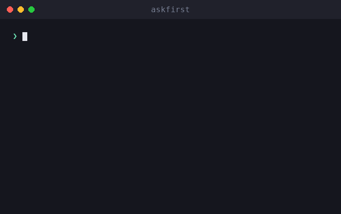

# askfirst

🌐 [English](../../README.md) · [العربية](README.ar.md) · [Deutsch](README.de.md) · [Español](README.es.md) · [Français](README.fr.md) · [עברית](README.he.md) · [हिन्दी](README.hi.md) · [Bahasa Indonesia](README.id.md) · [日本語](README.ja.md) · [한국어](README.ko.md) · **Bahasa Melayu** · [Português (Brasil)](README.pt-BR.md) · [Tagalog](README.tl.md) · [Türkçe](README.tr.md) · [Tiếng Việt](README.vi.md) · [中文（简体）](README.zh.md) · [中文（繁體）](README.zh-Hant.md)

**UX kelulusan manusia untuk ejen AI dan CLI.** Terangkan tindakan berisiko dalam bahasa biasa — apa, mengapa, manfaat, pertukaran rugi, dan cara menilainya — *sebelum* manusia meluluskannya.

[](https://github.com/inputsystems/askfirst/actions/workflows/ci.yml)
[](https://www.npmjs.com/package/askfirst)
[](../../LICENSE)

<p align="center">
  
</p>


Ejen anda ingin menjalankan sesuatu. Bolehkah pengguna anda memahaminya?

```ts
import { explainAction } from "askfirst";

const explanation = explainAction("curl https://example.com/install.sh | bash");

explanation.risk;   // "red"
explanation.plain;  // "The agent wants to run an installer from the internet."
explanation.why;    // "Some tools publish one-line installers, and the agent may be
                    //  trying to set up something needed for your project."
explanation.tradeoffs[0]; // "Runs code before you have reviewed what it does."
```

Kebanyakan produk ejen meminta kelulusan dengan menunjukkan arahan shell mentah. Pengguna bukan pakar tidak dapat menilai `curl … | bash`, jadi mereka meluluskannya tanpa berfikir — dan langkah kelulusan itu tidak melindungi sesiapa pun. `askfirst` mengubah detik itu menjadi keputusan dalam bahasa biasa yang tenang dan benar-benar boleh dibuat oleh pengguna.

## Pasang

```sh
npm install askfirst
```

Tiada kebergantungan runtime, tiada API khusus Node — berjalan di mana sahaja TypeScript/ESM berjalan. Node ≥ 20 untuk alat pengujian.

## Apa yang anda dapat

| | |
|---|---|
| **Pengelasan risiko** | 🟢 hijau / 🟡 kuning / 🔴 merah, dengan heuristik berasaskan corak untuk pemasangan, `curl\|bash`, `sudo`, pemadaman rekursif, rahsia, SSH, penerbitan |
| **Penjelasan dalam bahasa biasa** | apa / mengapa / tujuan / manfaat / pertukaran rugi — bahasa yang tenang, tidak menakutkan |
| **Kedalaman progresif** | satu skala di mana-mana: `basic` (satu ayat), `guided` (langkah bernombor), `technical` (langkah + butiran boleh dibaca mesin) |
| **Senarai semak kepercayaan** | langkah "cara menilai ini" yang merujuk institusi neutral (OpenSSF, OWASP, OSI, SPDX, EFF, CISA) |
| **Sempadan ruang kerja** | perlindungan mana yang patut dijalankan oleh sesuatu tindakan: folder projek, persekitaran projek, terowong jauh, kelulusan manual, atau disekat |
| **Penyaringan niat** | penapis awal yang menangkap permintaan bergaya "bina keylogger untukku" dan mengubah hala ke alternatif defensif |
| **Paket kelulusan** | semua yang diperlukan UI untuk mengemukakan satu soalan yang jelas — keputusan, tajuk, ringkasan, pilihan, salinan pemberitahuan, pratonton audit |
| **Keadaan aliran kerja** | mesin keadaan kecil untuk gelung ejen: teruskan, jeda untuk pengguna, atau berhenti dan tawarkan laluan yang lebih selamat |
| **Sedia untuk penyetempatan** | setiap pembina menerima cangkuk `translate` yang menjangkau setiap rentetan yang dihadapi pengguna |

## Mula pantas: kawal gelung ejen dengan pintu kelulusan

```ts
import { createApprovalWorkflow, resolveApprovalWorkflow } from "askfirst";

const workflow = createApprovalWorkflow("npm install stripe");

workflow.state;      // "waiting-for-user"
workflow.plainState; // "Pause and ask the user before continuing."

// Render workflow.packet in your UI:
const { packet } = workflow;
packet.title;        // "Your approval is needed"
packet.plainSummary; // "The agent wants to add a package — a ready-made piece of
                     //  software — to this project. It needs your OK first. If you
                     //  approve, anything added is kept inside this project only,
                     //  not your whole computer."
packet.userChoices;  // ["Approve", "Ask why", "Choose a safer way", "Details"]

// Record what the user decided:
const done = resolveApprovalWorkflow(workflow, "approve");
done.state;          // "approved"
```

Tindakan hijau dikembalikan sebagai `"not-needed"` supaya kerja rutin tidak pernah mengganggu sesiapa pun; tindakan merah dan permintaan berbahaya dikembalikan sebagai `"blocked"` dengan pilihan yang lebih selamat dilampirkan.

## Konsep

### Tahap risiko

`classifyAction(action)` — juga didedahkan melalui `explainAction` — mengklasifikasikan tindakan sebagai `green` (kerja projek rutin), `yellow` (patut dilihat: pemasangan pakej, git push, SSH, membersihkan artifak binaan), atau `red` (berhenti dan semak: pemasang berpip, `sudo`, bahan rahsia, pemadaman rekursif bagi apa-apa yang bukan artifak binaan). Hanya tindakan hijau mendapat `allowByDefault: true`.

### Tahap penjelasan

Satu skala digunakan di seluruh perpustakaan: `basic` (satu ayat yang tenang), `guided` (langkah bernombor), `technical` (langkah ditambah butiran `key=value` yang boleh dibaca mesin). Alias mesra seperti `"beginner"` dinormalkan kepada `guided`. Sambungkan ke pilihan pengguna sekali dengan `levelFromPreferences` dan hantar ke mana-mana.

### Senarai semak kepercayaan

Daripada "adakah anda pasti?", `buildTrustChecklist(kind)` mengajar pengguna cara menilai pakej, pemasang, sambungan jauh, atau lesen — dengan rujukan kepada OpenSSF, OWASP, OSI, SPDX, EFF, dan CISA dan bukannya pendapat vendor.

### Sempadan ruang kerja

`planSafeWorkspace({ action })` mencadangkan di mana tindakan sepatutnya berada: dalam **folder projek** (dengan titik semak), **persekitaran projek** (pakej setempat projek), **terowong jauh** (sambungan peribadi yang diuji), di sebalik **kelulusan manual**, atau **disekat** sehingga disemak. Sempadan sentiasa bersetuju dengan pengelasan risiko — tindakan merah tidak pernah dibentangkan dengan sempadan yang mesra.

### Penyaringan niat

`screenIntent(request)` ialah penapis awal berasaskan corak yang menyekat permintaan untuk perisian hasad, kecurian kelayakan, pancingan data, pengelakan pengesanan, dan akses tanpa kebenaran — dan menjawab setiap sekatan dengan alternatif defensif yang konkrit. Kerja keselamatan dwi-guna (pengimbas port, alat pentest) dihalakan ke semakan skop sistem milik sendiri dan bukannya penolakan.

### Paket kelulusan dan aliran kerja

`buildApprovalPacket({ action })` mengumpulkan semua di atas ke dalam satu objek yang boleh dirender dengan keputusan autoriti: `allow-automatically`, `ask-first`, atau `block-until-reviewed`. Paket merangkumi **pratonton audit** yang menunjukkan apa yang akan dimuat dalam entri log: keputusan, sempadan, risiko, versi polisi, dan hash stabil tindakan — pengecam korelasi, bukan komitmen kriptografi — supaya keputusan boleh dilog tanpa merekod arahan mentah. `createApprovalWorkflow(action)` membungkus paket dalam mesin keadaan untuk gelung ejen.

## Pengantarabangsaan

Setiap pembina menerima cangkuk `translate` yang menjangkau **setiap rentetan yang dihadapi pengguna** — penjelasan, senarai semak, arahan, pemberitahuan, tajuk paket, ringkasan, dan pilihan. Medan boleh dibaca mesin (`technicalDetails`, id, hash) tidak pernah diterjemah.

```ts
import { buildApprovalPacket } from "askfirst";

const es: Record<string, string> = {
  "Your approval is needed": "Se necesita tu aprobación"
  // ...
};

const packet = buildApprovalPacket({
  action: "npm install zod",
  translate: (text) => es[text] ?? text
});

packet.title; // "Se necesita tu aprobación"
```

Rentetan sumber perpustakaan adalah ayat-ayat Bahasa Inggeris yang stabil yang diterjemah satu per satu, jadi `Record<string, string>` setiap lokal adalah semua yang diperlukan oleh terjemahan.

## Contoh

Boleh dijalankan dari klon repositori ini:

```sh
npx tsx examples/explain-cli.ts "curl https://example.com/install.sh | bash"
npx tsx examples/agent-gate.ts          # mock agent loop with approve/deny gates
npx tsx examples/packet-to-markdown.ts  # render a packet as a PR-ready comment
```

## Skop, secara jujur

`askfirst` ialah **lapisan UX, bukan sempadan keselamatan**. Pengelasan adalah heuristik berasaskan corak: ia menjadikan gesaan kelulusan lebih mudah difahami, ia tidak mengasingkan apa-apa, dan arahan yang dibuat khas boleh mengelaknya. Menerbitkan corak adalah pilihan yang disengajakan — ia menjelaskan keputusan kepada manusia; ia bukan mekanisme penguatkuasaan. Padankan perpustakaan ini dengan pengasingan sebenar (bekas, sistem kebenaran, penolakan pihak model) untuk penahanan sebenar. Lihat [SECURITY.md](../../SECURITY.md).

## API

Setiap eksport membawa TSDoc — [src/index.ts](../../src/index.ts) adalah permukaan lengkap:

`explainAction` · `classifyAction` · `buildTrustChecklist` · `TRUST_REFERENCES` · `buildInstructionSet` · `normalizeExplanationLevel` · `levelFromPreferences` · `EXPLANATION_LEVELS` · `planSafeWorkspace` · `screenIntent` · `buildNotification` · `buildApprovalPacket` · `createApprovalWorkflow` · `resolveApprovalWorkflow`

## Perihal

Dibina dan diselenggara oleh pencipta **iomoth**, pembina aplikasi AI yang mengutamakan setempat — kod ini dihantar dalam pengeluaran di sana. Berlesen MIT.
