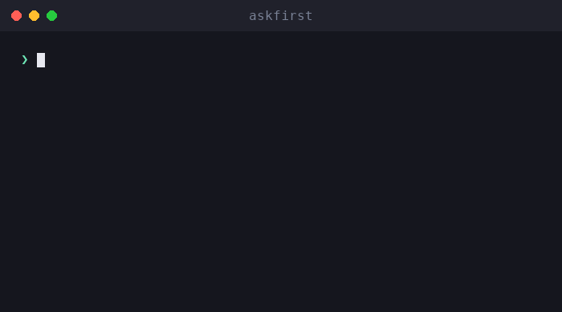

# askfirst

🌐 [English](../../README.md) · [العربية](README.ar.md) · [Deutsch](README.de.md) · [Español](README.es.md) · [Français](README.fr.md) · [עברית](README.he.md) · [हिन्दी](README.hi.md) · [Bahasa Indonesia](README.id.md) · [日本語](README.ja.md) · [한국어](README.ko.md) · [Bahasa Melayu](README.ms.md) · [Português (Brasil)](README.pt-BR.md) · [Tagalog](README.tl.md) · **Türkçe** · [Tiếng Việt](README.vi.md) · [中文（简体）](README.zh.md) · [中文（繁體）](README.zh-Hant.md)

**AI ajanları ve CLI'lar için insan onayı UX'i.** Riskli eylemleri sade bir dille açıklayın — ne olduğunu, nedenini, faydalarını, değiş tokuşlarını ve nasıl değerlendirileceğini — *insan onaylamadan önce*.

[](https://github.com/inputsystems/askfirst/actions/workflows/ci.yml)
[](https://www.npmjs.com/package/askfirst)
[](../../LICENSE)

<p align="center">
  
</p>


Ajanınız bir şey çalıştırmak istiyor. Kullanıcınız bunu anlayabilir mi?

```ts
import { explainAction } from "askfirst";

const explanation = explainAction("curl https://example.com/install.sh | bash");

explanation.risk;   // "red"
explanation.plain;  // "The agent wants to run an installer from the internet."
explanation.why;    // "Some tools publish one-line installers, and the agent may be
                    //  trying to set up something needed for your project."
explanation.tradeoffs[0]; // "Runs code before you have reviewed what it does."
```

Çoğu ajan ürünü, ham kabuk komutunu göstererek onay ister. Uzman olmayanlar `curl … | bash` komutunu değerlendiremez; bu yüzden körü körüne onaylarlar ve onay adımı kimseyi korumaz. `askfirst`, o anı kullanıcının gerçekten karar verebileceği sakin, sade dilli bir karşılaşmaya dönüştürür.

## Kurulum

```sh
npm install askfirst
```

Sıfır çalışma zamanı bağımlılığı, Node'a özgü API yok — TypeScript/ESM'in çalıştığı her yerde çalışır. Test araçları için Node ≥ 20.

## Ne elde edersiniz

| | |
|---|---|
| **Risk sınıflandırması** | 🟢 yeşil / 🟡 sarı / 🔴 kırmızı; yüklemeler, `curl\|bash`, `sudo`, yinelemeli silmeler, sırlar, SSH, yayımlama için örüntü tabanlı sezgisel yöntemler |
| **Sade dil açıklamaları** | ne / neden / amaç / faydalar / değiş tokuşlar — sakin bir ton, asla abartılı değil |
| **Aşamalı derinlik** | Her yerde tek bir ölçek: `basic` (tek cümle), `guided` (numaralı adımlar), `technical` (adımlar + makine tarafından okunabilir ayrıntılar) |
| **Güven denetim listeleri** | "Bunu nasıl değerlendirirsiniz" adımları; tarafsız kuruluşlara (OpenSSF, OWASP, OSI, SPDX, EFF, CISA) atıflar |
| **Çalışma alanı sınırları** | Bir eylemin hangi korumada çalışması gerektiği: proje klasörü, proje ortamı, uzak tünel, manuel onay veya engellendi |
| **Niyet taraması** | "Bana bir keylogger yap" tarzı istekleri yakalayan ve savunma amaçlı alternatiflere yönlendiren bir ön filtre |
| **Onay paketleri** | Bir UI'nın tek net bir soru sorması için ihtiyaç duyduğu her şey — karar, başlık, özet, seçenekler, bildirim metni, denetim önizlemesi |
| **İş akışı durumları** | Ajan döngüleri için küçük bir durum makinesi: devam et, kullanıcı için duraklat veya dur ve daha güvenli bir yol sun |
| **Yerelleştirmeye hazır** | Her oluşturucu, kullanıcıya yönelik her dizeye ulaşan bir `translate` kancasını kabul eder |

## Hızlı başlangıç: bir ajan döngüsüne kapı koy

```ts
import { createApprovalWorkflow, resolveApprovalWorkflow } from "askfirst";

const workflow = createApprovalWorkflow("npm install stripe");

workflow.state;      // "waiting-for-user"
workflow.plainState; // "Pause and ask the user before continuing."

// Render workflow.packet in your UI:
const { packet } = workflow;
packet.title;        // "Your approval is needed"
packet.plainSummary; // "The agent wants to add a package — a ready-made piece of
                     //  software — to this project. It needs your OK first. If you
                     //  approve, anything added is kept inside this project only,
                     //  not your whole computer."
packet.userChoices;  // ["Approve", "Ask why", "Choose a safer way", "Details"]

// Record what the user decided:
const done = resolveApprovalWorkflow(workflow, "approve");
done.state;          // "approved"
```

Yeşil eylemler `"not-needed"` olarak döner, böylece rutin çalışma hiç kimseyi aksatmaz; kırmızı eylemler ve zararlı istekler, eklenmiş daha güvenli seçeneklerle `"blocked"` olarak döner.

## Kavramlar

### Risk seviyeleri

`classifyAction(action)` — aynı zamanda `explainAction` üzerinden de sunulur — bir eylemi `green` (rutin proje çalışması), `yellow` (bir göz atmaya değer: paket yüklemeleri, git push, SSH, derleme artefaktlarını temizleme) veya `red` (dur ve incele: borulu yükleyiciler, `sudo`, gizli materyal, derleme artefaktı olmayan bir şeyin yinelemeli silmesi) olarak sınıflandırır. Yalnızca yeşil eylemler `allowByDefault: true` alır.

### Açıklama seviyeleri

Kütüphanenin tamamında tek bir ölçek çalışır: `basic` (tek sakin cümle), `guided` (numaralı adımlar), `technical` (adımlar artı makine tarafından okunabilir `key=value` ayrıntıları). `"beginner"` gibi kullanıcı dostu takma adlar `guided` olarak normalleştirilir. `levelFromPreferences` ile bir kez kullanıcı tercihine bağlayın ve her yerde kullanın.

### Güven denetim listeleri

"Emin misiniz?" yerine, `buildTrustChecklist(kind)` kullanıcıya bir paketi, yükleyiciyi, uzak bağlantıyı veya lisansı nasıl değerlendireceğini öğretir — satıcı görüşleri yerine OpenSSF, OWASP, OSI, SPDX, EFF ve CISA'ya yapılan atıflarla.

### Çalışma alanı sınırları

`planSafeWorkspace({ action })`, bir eylemin nereye ait olduğunu önerir: **proje klasörünün** içi (kontrol noktalarıyla), **proje ortamı** (projeye yerel paketler), **uzak tünel** (özel, test edilmiş bağlantılar), **manuel onay** arkası veya incelenene kadar **engellendi**. Sınır her zaman risk sınıflandırmasıyla örtüşür — kırmızı bir eylem asla kullanıcı dostu bir sınırla sunulmaz.

### Niyet taraması

`screenIntent(request)`, kötü amaçlı yazılım, kimlik bilgisi hırsızlığı, kimlik avı, tespit atlatma ve yetkisiz erişim isteklerini engelleyen ve her engele somut savunma amaçlı alternatiflerle yanıt veren örüntü tabanlı bir ön filtredir. Çift kullanımlı güvenlik çalışmaları (port tarayıcıları, sızma testi araçları) ret yerine sahip olunan sistem kapsam kontrolüne yönlendirilir.

### Onay paketleri ve iş akışları

`buildApprovalPacket({ action })`, yukarıdakilerin tümünü yetkili bir kararla birlikte tek bir görüntülenebilir nesne halinde bir araya getirir: `allow-automatically`, `ask-first` veya `block-until-reviewed`. Paket, bir günlük girişinin neyi içereceğini gösteren bir **denetim önizlemesi** içerir: karar, sınır, risk, politika sürümü ve eylemin kararlı bir karması — bir korelasyon tanımlayıcısı, kriptografik bir taahhüt değil — böylece kararlar, ham komutu günlüğe kaydetmeden kaydedilebilir. `createApprovalWorkflow(action)` paketi ajan döngüleri için bir durum makinesine sarar.

## Uluslararasılaştırma

Her oluşturucu, **kullanıcıya yönelik her dizeye** ulaşan bir `translate` kancasını kabul eder — açıklamalar, denetim listeleri, talimatlar, bildirimler, paket başlıkları, özetler ve seçenekler. Makine tarafından okunabilir alanlar (`technicalDetails`, id'ler, karmalar) hiçbir zaman çevrilmez.

```ts
import { buildApprovalPacket } from "askfirst";

const es: Record<string, string> = {
  "Your approval is needed": "Se necesita tu aprobación"
  // ...
};

const packet = buildApprovalPacket({
  action: "npm install zod",
  translate: (text) => es[text] ?? text
});

packet.title; // "Se necesita tu aprobación"
```

Kütüphanenin kaynak dizeleri, birim birim çevrilen kararlı İngilizce cümlelerdir; bu nedenle bir çeviri için yerel başına bir `Record<string, string>` yeterlidir.

## Örnekler

Bu deponun bir klonundan çalıştırılabilir:

```sh
npx tsx examples/explain-cli.ts "curl https://example.com/install.sh | bash"
npx tsx examples/agent-gate.ts          # mock agent loop with approve/deny gates
npx tsx examples/packet-to-markdown.ts  # render a packet as a PR-ready comment
```

## Kapsam, dürüstçe

`askfirst`, **bir UX katmanıdır, güvenlik sınırı değil**. Sınıflandırmalar örüntü tabanlı sezgisel yöntemlerdir: onay istemlerini anlaşılır kılarlar, hiçbir şeyi sandbox içine almazlar ve özel hazırlanmış bir komut bunları atlatabilir. Desenleri yayımlamak bilinçli bir seçimdir — insanlara kararları açıklarlar; uygulama mekanizması değillerdir. Gerçek sınırlama için bu kütüphaneyi gerçek yalıtımla (konteynerler, izin sistemleri, model tarafı retleri) eşleştirin. Bkz. [SECURITY.md](../../SECURITY.md).

## API

Her dışa aktarım TSDoc içerir — [src/index.ts](../../src/index.ts) tam yüzeydir:

`explainAction` · `classifyAction` · `buildTrustChecklist` · `TRUST_REFERENCES` · `buildInstructionSet` · `normalizeExplanationLevel` · `levelFromPreferences` · `EXPLANATION_LEVELS` · `planSafeWorkspace` · `screenIntent` · `buildNotification` · `buildApprovalPacket` · `createApprovalWorkflow` · `resolveApprovalWorkflow`

## Hakkında

**iomoth**'un yapımcıları tarafından oluşturulmuş ve bakımı yapılmaktadır; iomoth yerel öncelikli bir AI uygulama oluşturucusudur — bu kod orada üretimde çalışmaktadır. MIT lisanslı.
