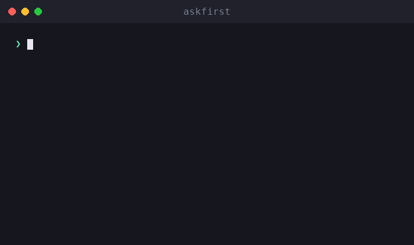

# askfirst

🌐 [English](../../README.md) · [العربية](README.ar.md) · [Deutsch](README.de.md) · [Español](README.es.md) · [Français](README.fr.md) · [עברית](README.he.md) · [हिन्दी](README.hi.md) · [Bahasa Indonesia](README.id.md) · [日本語](README.ja.md) · [한국어](README.ko.md) · [Bahasa Melayu](README.ms.md) · [Português (Brasil)](README.pt-BR.md) · [Tagalog](README.tl.md) · [Türkçe](README.tr.md) · **Tiếng Việt** · [中文（简体）](README.zh.md) · [中文（繁體）](README.zh-Hant.md)

**UX phê duyệt của con người cho các tác nhân AI và CLI.** Giải thích các hành động rủi ro bằng ngôn ngữ đơn giản — nội dung, lý do, lợi ích, sự đánh đổi và cách đánh giá chúng — *trước khi* con người phê duyệt.

[](https://github.com/inputsystems/askfirst/actions/workflows/ci.yml)
[](https://www.npmjs.com/package/askfirst)
[](../../LICENSE)

<p align="center">
  
</p>


Tác nhân của bạn muốn chạy thứ gì đó. Người dùng của bạn có hiểu được không?

```ts
import { explainAction } from "askfirst";

const explanation = explainAction("curl https://example.com/install.sh | bash");

explanation.risk;   // "red"
explanation.plain;  // "The agent wants to run an installer from the internet."
explanation.why;    // "Some tools publish one-line installers, and the agent may be
                    //  trying to set up something needed for your project."
explanation.tradeoffs[0]; // "Runs code before you have reviewed what it does."
```

Hầu hết các sản phẩm tác nhân yêu cầu phê duyệt bằng cách hiển thị lệnh shell thô. Người không chuyên không thể đánh giá `curl … | bash`, vì vậy họ chỉ bấm chấp thuận mà không suy nghĩ — và bước phê duyệt không bảo vệ ai. `askfirst` biến khoảnh khắc đó thành một quyết định bình tĩnh, bằng ngôn ngữ đơn giản mà người dùng thực sự có thể đưa ra.

## Cài đặt

```sh
npm install askfirst
```

Không có phụ thuộc runtime, không có API dành riêng cho Node — chạy ở bất kỳ đâu TypeScript/ESM chạy được. Node ≥ 20 cho công cụ kiểm tra.

## Những gì bạn nhận được

| | |
|---|---|
| **Phân loại rủi ro** | 🟢 xanh lá / 🟡 vàng / 🔴 đỏ, với heuristics dựa trên mẫu cho các lần cài đặt, `curl\|bash`, `sudo`, xóa đệ quy, bí mật, SSH, xuất bản |
| **Giải thích bằng ngôn ngữ đơn giản** | nội dung / lý do / mục đích / lợi ích / sự đánh đổi — câu chữ bình tĩnh, không bao giờ gây hoảng loạn |
| **Độ sâu lũy tiến** | một thang đo duy nhất trên toàn bộ: `basic` (một câu), `guided` (các bước đánh số), `technical` (các bước + chi tiết có thể đọc bằng máy) |
| **Danh sách kiểm tra tin cậy** | các bước "cách đánh giá điều này" trích dẫn các tổ chức trung lập (OpenSSF, OWASP, OSI, SPDX, EFF, CISA) |
| **Ranh giới không gian làm việc** | một hành động nên chạy bên trong lớp bảo vệ nào: thư mục dự án, môi trường dự án, đường hầm từ xa, phê duyệt thủ công hoặc bị chặn |
| **Sàng lọc ý định** | bộ lọc trước bắt các yêu cầu kiểu "xây dựng keylogger cho tôi" và chuyển hướng đến các lựa chọn thay thế phòng thủ |
| **Gói phê duyệt** | mọi thứ giao diện người dùng cần để hỏi một câu hỏi rõ ràng — quyết định, tiêu đề, tóm tắt, lựa chọn, bản sao thông báo, xem trước kiểm toán |
| **Trạng thái quy trình làm việc** | một máy trạng thái nhỏ cho các vòng lặp tác nhân: tiếp tục, tạm dừng cho người dùng, hoặc dừng và đề xuất con đường an toàn hơn |
| **Sẵn sàng địa phương hóa** | mọi trình xây dựng đều chấp nhận hook `translate` tiếp cận mọi chuỗi hiển thị cho người dùng |

## Khởi động nhanh: kiểm soát vòng lặp tác nhân

```ts
import { createApprovalWorkflow, resolveApprovalWorkflow } from "askfirst";

const workflow = createApprovalWorkflow("npm install stripe");

workflow.state;      // "waiting-for-user"
workflow.plainState; // "Pause and ask the user before continuing."

// Render workflow.packet in your UI:
const { packet } = workflow;
packet.title;        // "Your approval is needed"
packet.plainSummary; // "The agent wants to add a package — a ready-made piece of
                     //  software — to this project. It needs your OK first. If you
                     //  approve, anything added is kept inside this project only,
                     //  not your whole computer."
packet.userChoices;  // ["Approve", "Ask why", "Choose a safer way", "Details"]

// Record what the user decided:
const done = resolveApprovalWorkflow(workflow, "approve");
done.state;          // "approved"
```

Các hành động xanh lá trả về là `"not-needed"` để công việc thường xuyên không bao giờ làm gián đoạn ai; các hành động đỏ và yêu cầu có hại trả về là `"blocked"` với các lựa chọn an toàn hơn được đính kèm.

## Khái niệm

### Mức độ rủi ro

`classifyAction(action)` — cũng được hiển thị qua `explainAction` — phân loại một hành động là `green` (công việc dự án thường xuyên), `yellow` (đáng xem xét: cài đặt gói, git push, SSH, làm sạch tạo phẩm xây dựng), hoặc `red` (dừng và xem xét: trình cài đặt qua pipe, `sudo`, tài liệu bí mật, xóa đệ quy bất cứ thứ gì không phải tạo phẩm xây dựng). Chỉ các hành động xanh lá mới có `allowByDefault: true`.

### Mức độ giải thích

Một thang đo chạy qua toàn bộ thư viện: `basic` (một câu bình tĩnh), `guided` (các bước đánh số), `technical` (các bước cộng với chi tiết `key=value` có thể đọc bằng máy). Các bí danh thân thiện như `"beginner"` được chuẩn hóa thành `guided`. Kết nối nó với tùy chọn người dùng một lần với `levelFromPreferences` và truyền nó ở khắp nơi.

### Danh sách kiểm tra tin cậy

Thay vì "bạn có chắc không?", `buildTrustChecklist(kind)` dạy người dùng cách đánh giá một gói, trình cài đặt, kết nối từ xa hoặc giấy phép — với tham chiếu đến OpenSSF, OWASP, OSI, SPDX, EFF và CISA thay vì ý kiến nhà cung cấp.

### Ranh giới không gian làm việc

`planSafeWorkspace({ action })` đề xuất nơi một hành động thuộc về: bên trong **thư mục dự án** (với điểm kiểm tra), **môi trường dự án** (các gói cục bộ cho dự án), một **đường hầm từ xa** (kết nối riêng tư, đã kiểm tra), sau **phê duyệt thủ công**, hoặc **bị chặn** cho đến khi xem xét. Ranh giới luôn đồng ý với phân loại rủi ro — một hành động đỏ không bao giờ được trình bày với ranh giới thân thiện.

### Sàng lọc ý định

`screenIntent(request)` là bộ lọc trước dựa trên mẫu chặn các yêu cầu về phần mềm độc hại, đánh cắp thông tin xác thực, lừa đảo, trốn tránh phát hiện và truy cập trái phép — và trả lời mỗi lần chặn với các lựa chọn thay thế phòng thủ cụ thể. Công việc bảo mật sử dụng kép (máy quét cổng, công cụ pentest) được chuyển đến kiểm tra phạm vi hệ thống thuộc sở hữu thay vì từ chối.

### Gói phê duyệt và quy trình làm việc

`buildApprovalPacket({ action })` tập hợp tất cả những điều trên thành một đối tượng có thể render với quyết định có thẩm quyền: `allow-automatically`, `ask-first`, hoặc `block-until-reviewed`. Gói bao gồm **xem trước kiểm toán** hiển thị những gì một mục nhập nhật ký sẽ chứa: quyết định, ranh giới, rủi ro, phiên bản chính sách và hash ổn định của hành động — một định danh tương quan, không phải cam kết mật mã — để các quyết định có thể được ghi lại mà không ghi lại lệnh thô. `createApprovalWorkflow(action)` bọc gói trong một máy trạng thái cho các vòng lặp tác nhân.

## Quốc tế hóa

Mọi trình xây dựng đều chấp nhận hook `translate` tiếp cận **mọi chuỗi hiển thị cho người dùng** — giải thích, danh sách kiểm tra, hướng dẫn, thông báo, tiêu đề gói, tóm tắt và lựa chọn. Các trường có thể đọc bằng máy (`technicalDetails`, ids, hashes) không bao giờ được dịch.

```ts
import { buildApprovalPacket } from "askfirst";

const es: Record<string, string> = {
  "Your approval is needed": "Se necesita tu aprobación"
  // ...
};

const packet = buildApprovalPacket({
  action: "npm install zod",
  translate: (text) => es[text] ?? text
});

packet.title; // "Se necesita tu aprobación"
```

Các chuỗi nguồn của thư viện là các câu tiếng Anh ổn định được dịch từng đơn vị, vì vậy một `Record<string, string>` cho mỗi ngôn ngữ là tất cả những gì một bản dịch cần.

## Ví dụ

Có thể chạy từ bản sao của repo này:

```sh
npx tsx examples/explain-cli.ts "curl https://example.com/install.sh | bash"
npx tsx examples/agent-gate.ts          # mock agent loop with approve/deny gates
npx tsx examples/packet-to-markdown.ts  # render a packet as a PR-ready comment
```

## Phạm vi, thành thật mà nói

`askfirst` là một **lớp UX, không phải ranh giới bảo mật**. Các phân loại là heuristics dựa trên mẫu: chúng làm cho các lời nhắc phê duyệt dễ hiểu, chúng không cô lập bất cứ thứ gì, và một lệnh được tạo thủ công có thể lách qua chúng. Xuất bản các mẫu là lựa chọn có chủ đích — chúng giải thích các quyết định cho con người; chúng không phải là cơ chế thực thi. Kết hợp thư viện này với sự cô lập thực sự (container, hệ thống quyền, từ chối phía mô hình) để kiểm soát thực sự. Xem [SECURITY.md](../../SECURITY.md).

## API

Mọi export đều có TSDoc — [src/index.ts](../../src/index.ts) là bề mặt đầy đủ:

`explainAction` · `classifyAction` · `buildTrustChecklist` · `TRUST_REFERENCES` · `buildInstructionSet` · `normalizeExplanationLevel` · `levelFromPreferences` · `EXPLANATION_LEVELS` · `planSafeWorkspace` · `screenIntent` · `buildNotification` · `buildApprovalPacket` · `createApprovalWorkflow` · `resolveApprovalWorkflow`

## Giới thiệu

Được xây dựng và duy trì bởi những người tạo ra **iomoth**, một trình xây dựng ứng dụng AI ưu tiên cục bộ — mã này được triển khai trong sản xuất ở đó. Cấp phép MIT.
