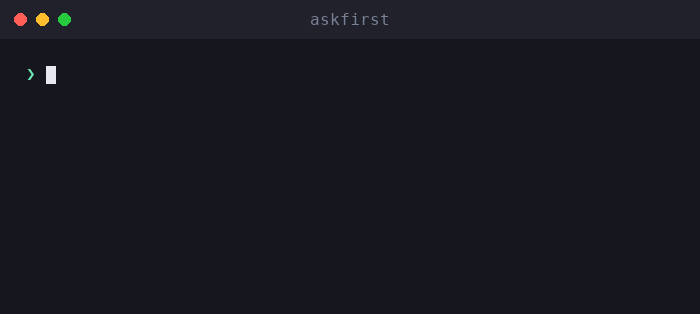

# askfirst

🌐 [English](../../README.md) · [العربية](README.ar.md) · [Deutsch](README.de.md) · [Español](README.es.md) · [Français](README.fr.md) · [עברית](README.he.md) · [हिन्दी](README.hi.md) · [Bahasa Indonesia](README.id.md) · [日本語](README.ja.md) · [한국어](README.ko.md) · [Bahasa Melayu](README.ms.md) · [Português (Brasil)](README.pt-BR.md) · [Tagalog](README.tl.md) · [Türkçe](README.tr.md) · [Tiếng Việt](README.vi.md) · [中文（简体）](README.zh.md) · **中文（繁體）**

**AI 代理程式與命令列介面的人工核准使用者體驗。** 以簡明語言說明有風險的操作——包括是什麼、為什麼、優點、取捨和判斷方式——*在*人類核准之前。

[](https://github.com/inputsystems/askfirst/actions/workflows/ci.yml)
[](https://www.npmjs.com/package/askfirst)
[](../../LICENSE)

<p align="center">
  
</p>


您的代理程式想要執行某項操作。您的使用者能理解它嗎？

```ts
import { explainAction } from "askfirst";

const explanation = explainAction("curl https://example.com/install.sh | bash");

explanation.risk;   // "red"
explanation.plain;  // "The agent wants to run an installer from the internet."
explanation.why;    // "Some tools publish one-line installers, and the agent may be
                    //  trying to set up something needed for your project."
explanation.tradeoffs[0]; // "Runs code before you have reviewed what it does."
```

大多數代理程式產品透過顯示原始 shell 指令來要求核准。非專業使用者無法評估 `curl … | bash`，因此他們往往不加思考地蓋章同意，而核准步驟形同虛設。`askfirst` 將這個時刻轉化為使用者真正能夠做出的平和、簡明的決策。

## 安裝

```sh
npm install askfirst
```

零執行時期相依項目，不使用 Node 特有的 API——可在任何支援 TypeScript/ESM 的環境中執行。測試工具需要 Node ≥ 20。

## 功能一覽

| | |
|---|---|
| **風險分類** | 🟢 綠色 / 🟡 黃色 / 🔴 紅色，並針對安裝、`curl\|bash`、`sudo`、遞迴刪除、機密資訊、SSH、發布等情況提供基於模式的啟發式判斷 |
| **簡明語言說明** | 是什麼／為什麼／目的／優點／取捨——平和的措辭，絕不危言聳聽 |
| **漸進式深度** | 整個函式庫使用統一的等級：`basic`（一句話）、`guided`（編號步驟）、`technical`（步驟加機器可讀詳細資訊） |
| **信任檢查清單** | 「如何判斷此操作」步驟，引用中立機構（OpenSSF、OWASP、OSI、SPDX、EFF、CISA） |
| **工作區邊界** | 指定操作應在哪種保護範圍內執行：專案資料夾、專案環境、遠端通道、手動核准或封鎖 |
| **意圖篩選** | 預先過濾器，可攔截「幫我建一個鍵盤記錄器」類型的要求，並將其重新導向至防禦性替代方案 |
| **核准封包** | 為介面提供詢問一個清晰問題所需的一切——決策、標題、摘要、選項、通知文案、稽核預覽 |
| **工作流程狀態** | 供代理程式迴圈使用的小型狀態機：繼續、暫停等待使用者，或停止並提供更安全的路徑 |
| **本地化就緒** | 每個建置器都接受一個 `translate` 鉤子，可觸及每個面向使用者的字串 |

## 快速開始：為代理程式迴圈設置關卡

```ts
import { createApprovalWorkflow, resolveApprovalWorkflow } from "askfirst";

const workflow = createApprovalWorkflow("npm install stripe");

workflow.state;      // "waiting-for-user"
workflow.plainState; // "Pause and ask the user before continuing."

// Render workflow.packet in your UI:
const { packet } = workflow;
packet.title;        // "Your approval is needed"
packet.plainSummary; // "The agent wants to add a package — a ready-made piece of
                     //  software — to this project. It needs your OK first. If you
                     //  approve, anything added is kept inside this project only,
                     //  not your whole computer."
packet.userChoices;  // ["Approve", "Ask why", "Choose a safer way", "Details"]

// Record what the user decided:
const done = resolveApprovalWorkflow(workflow, "approve");
done.state;          // "approved"
```

綠色操作會以 `"not-needed"` 的形式回傳，因此日常工作不會打斷任何人；紅色操作和有害要求則會以 `"blocked"` 回傳，並附上更安全的選項。

## 核心概念

### 風險等級

`classifyAction(action)`——也可透過 `explainAction` 存取——將操作分類為 `green`（日常專案工作）、`yellow`（值得關注：套件安裝、git push、SSH、清理建置產物）或 `red`（停止並審閱：管道安裝程式、`sudo`、機密資料、非建置產物的遞迴刪除）。只有綠色操作的 `allowByDefault` 為 `true`。

### 說明等級

整個函式庫使用統一的等級：`basic`（一句平和的話）、`guided`（編號步驟）、`technical`（步驟加機器可讀的 `key=value` 詳細資訊）。`"beginner"` 等友善別名會正規化為 `guided`。使用 `levelFromPreferences` 根據使用者偏好設定一次，然後在各處傳遞使用。

### 信任檢查清單

`buildTrustChecklist(kind)` 不是問「您確定嗎？」，而是教導使用者如何判斷套件、安裝程式、遠端連線或授權條款——引用 OpenSSF、OWASP、OSI、SPDX、EFF 和 CISA，而非廠商意見。

### 工作區邊界

`planSafeWorkspace({ action })` 提議操作應歸屬的位置：**專案資料夾**內（附有檢查點）、**專案環境**（僅限專案的套件）、**遠端通道**（私密、已測試的連線）、**手動核准**之後，或**封鎖**直到審閱完成。邊界始終與風險分類一致——紅色操作絕不會以友善的邊界呈現。

### 意圖篩選

`screenIntent(request)` 是一個基於模式的預先過濾器，可封鎖惡意軟體、憑證竊取、網路釣魚、規避偵測和未授權存取的要求——並針對每次封鎖提供具體的防禦性替代方案。雙用途安全性工作（連接埠掃描器、滲透測試工具）會被導向自有系統範圍確認，而非直接拒絕。

### 核准封包與工作流程

`buildApprovalPacket({ action })` 將上述所有內容組合成一個可渲染的物件，並附有權威性決策：`allow-automatically`、`ask-first` 或 `block-until-reviewed`。封包包含一個**稽核預覽**，顯示日誌條目的內容：決策、邊界、風險、原則版本，以及操作的穩定雜湊值——這是一個關聯識別碼，而非密碼學承諾——讓決策可以被記錄而無需記錄原始指令。`createApprovalWorkflow(action)` 將封包包裝在供代理程式迴圈使用的狀態機中。

## 國際化

每個建置器都接受一個 `translate` 鉤子，可觸及**每個面向使用者的字串**——說明、檢查清單、說明、通知、封包標題、摘要和選項。機器可讀的欄位（`technicalDetails`、id、雜湊值）不會被翻譯。

```ts
import { buildApprovalPacket } from "askfirst";

const es: Record<string, string> = {
  "Your approval is needed": "Se necesita tu aprobación"
  // ...
};

const packet = buildApprovalPacket({
  action: "npm install zod",
  translate: (text) => es[text] ?? text
});

packet.title; // "Se necesita tu aprobación"
```

函式庫的原始字串是穩定的英文句子，以逐一翻譯的方式處理，因此每個語言環境只需要一個 `Record<string, string>` 即可完成翻譯。

## 範例

可從此儲存庫的複製版本執行：

```sh
npx tsx examples/explain-cli.ts "curl https://example.com/install.sh | bash"
npx tsx examples/agent-gate.ts          # mock agent loop with approve/deny gates
npx tsx examples/packet-to-markdown.ts  # render a packet as a PR-ready comment
```

## 範圍說明

`askfirst` 是一個**使用者體驗層，而非安全性邊界**。分類基於模式的啟發式判斷：它們讓核准提示更易於理解，但不會沙箱化任何內容，且精心製作的指令可以規避它們。公開這些模式是刻意的選擇——它們是向人類解釋決策的工具；它們並非強制執行機制。若要真正達到隔離效果，請將此函式庫與實際的隔離措施（容器、權限系統、模型端拒絕）搭配使用。請參閱 [SECURITY.md](../../SECURITY.md)。

## API

每個匯出都附有 TSDoc——[src/index.ts](../../src/index.ts) 是完整的介面：

`explainAction` · `classifyAction` · `buildTrustChecklist` · `TRUST_REFERENCES` · `buildInstructionSet` · `normalizeExplanationLevel` · `levelFromPreferences` · `EXPLANATION_LEVELS` · `planSafeWorkspace` · `screenIntent` · `buildNotification` · `buildApprovalPacket` · `createApprovalWorkflow` · `resolveApprovalWorkflow`

## 關於

由 **iomoth** 的製作團隊建置和維護——iomoth 是一個本機優先的 AI 應用程式建置器——此程式碼已在生產環境中使用。MIT 授權。
